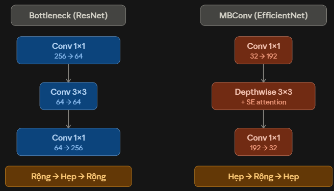

EfficientNet (Google, 2019) không đưa ra một khối residual mới hoàn toàn, mà giải quyết một câu hỏi khác: **"mở rộng một mạng CNN theo tỉ lệ nào là tối ưu nhất?"** — và câu trả lời của nó dẫn đến một thiết kế khối khác hẳn ResNet, dù vẫn giữ tinh thần skip connection.

## 1. Bối cảnh: scaling CNN theo kiểu cũ rất "mất cân đối"

Trước EfficientNet, người ta mở rộng mạng theo **một chiều duy nhất**:
- Tăng **độ sâu** (ResNet-50 → 101 → 152)
- Hoặc tăng **độ rộng** (Wide ResNet)
- Hoặc tăng **độ phân giải ảnh đầu vào**

Nhưng tăng riêng lẻ một chiều rất nhanh gặp hiệu suất giảm dần (diminishing returns) — ví dụ tăng độ phân giải ảnh mà không tăng độ sâu, mạng không đủ "tầm nhìn" (receptive field) để tận dụng chi tiết mới; tăng độ sâu mà ảnh vẫn nhỏ thì các lớp cuối chẳng còn gì để xử lý.

## 2. Ý tưởng cốt lõi: Compound Scaling — mở rộng cả 3 chiều cùng lúc, theo tỉ lệ cố định

EfficientNet đề xuất: dùng **một hệ số duy nhất φ** để mở rộng đồng thời cả ba chiều theo công thức:

- Độ sâu: d = α^φ
- Độ rộng: w = β^φ  
- Độ phân giải: r = γ^φ

với ràng buộc α·β²·γ² ≈ 2 (α, β, γ tìm được qua grid search nhỏ trên mô hình gốc). Cứ tăng φ lên 1, tổng chi phí tính toán tăng khoảng gấp đôi, nhưng cả 3 chiều đều được mở rộng **cân đối** với nhau, không bị lệch.

## 3. Khối xây dựng: MBConv — "Bottleneck ngược" so với ResNet

<p align="center">
  
</p>

Đây là phần thú vị nhất, vì nó gần như **đối lập** với Bottleneck Block của ResNet mà bạn đã học.Đây chính là "inverted bottleneck" (bottleneck ngược) — ý tưởng gốc từ MobileNetV2, được EfficientNet kế thừa. Trong khi ResNet **nén trước rồi mở rộng** (giảm kênh để tiết kiệm chi phí lớp 3×3 đắt tiền), MBConv **mở rộng trước rồi nén** — vì lý do khác hẳn: nó dùng **Depthwise Convolution** thay vì Conv 3×3 thường.

## 4. Vì sao MBConv "dám" mở rộng kênh mà vẫn rẻ: Depthwise Convolution

### 4.1 Vấn đề với Conv 3×3 thông thường

Hãy tưởng tượng feature map của bạn có **32 kênh** (32 tờ giấy xếp chồng nhau, mỗi tờ là một "bản đồ đặc trưng"). Khi áp một Conv 3×3 thông thường để tạo ra **64 kênh đầu ra**:

- **Mỗi kênh đầu ra** phải học một bộ lọc 3×3 **nhân với TẤT CẢ 32 kênh đầu vào** → 3×3×32 = 288 tham số cho 1 kênh đầu ra.
- Để tạo ra 64 kênh đầu ra → **64 × 288 = 18,432 phép nhân** mỗi vị trí pixel.

👉 **Chi phí = C_in × C_out × K × K** (tích của hai số kênh — tăng rất nhanh!)

### 4.2 Depthwise Convolution — "chia để trị"

Ý tưởng cốt lõi: **tách bài toán ra làm 2 bước nhỏ hơn và rẻ hơn**.

**Bước 1 — Depthwise Conv (lọc không gian, từng kênh một):**

```
Đầu vào: 32 kênh
         ↓  ↓  ↓  ...  ↓   (32 kênh)
        [f][f][f] ... [f]   ← mỗi kênh có 1 bộ lọc 3×3 RIÊNG
         ↓  ↓  ↓  ...  ↓
Đầu ra: 32 kênh  (y chang số kênh vào, KHÔNG trộn kênh)
```

- Kênh 1 → chỉ lọc kênh 1, bằng bộ lọc 3×3 của riêng nó.
- Kênh 2 → chỉ lọc kênh 2, bằng bộ lọc 3×3 của riêng nó.
- ...
- **Chi phí = C_in × K × K** (tuyến tính với số kênh, không phải tích!).

Với ví dụ trên: 32 × 3×3 = **288 phép nhân** thay vì 18,432. Rẻ hơn **64 lần**!

**Bước 2 — Pointwise Conv / Conv 1×1 (trộn kênh, không xử lý không gian):**

```
Đầu vào: 32 kênh
         ↓
    [1×1 Conv]   ← trộn thông tin giữa các kênh, không nhìn láng giềng
         ↓
Đầu ra: 64 kênh  (số kênh tuỳ ý, nhưng chỉ xử lý từng pixel độc lập)
```

- Conv 1×1 chỉ trộn thông tin **giữa các kênh** tại cùng một vị trí pixel, không "nhìn" sang pixel xung quanh.
- **Chi phí = C_in × C_out × 1 × 1** — nhưng vì K=1, rẻ hơn rất nhiều so với K=3.

### 4.3 So sánh chi phí trực quan

| Phương pháp | Công thức chi phí | Ví dụ (32→64 kênh) |
|---|---|---|
| Conv 3×3 thông thường | C_in × C_out × 9 | 32 × 64 × 9 = **18,432** |
| Depthwise 3×3 | C_in × 9 | 32 × 9 = **288** |
| Pointwise 1×1 | C_in × C_out | 32 × 64 = **2,048** |
| **Depthwise + Pointwise** | **288 + 2,048** | **2,336** (rẻ hơn ~8 lần!) |

Đây chính là lý do MBConv **dám** mở rộng lên 6× số kênh (ví dụ: 32 → 192) trước bước depthwise — vì ngay cả với 192 kênh, depthwise conv vẫn rẻ hơn conv thường trên số kênh nhỏ hơn.

### 4.4 Squeeze-and-Excitation (SE) — "attention nhẹ" sau depthwise

#### Vấn đề SE giải quyết là gì?

Sau depthwise conv, bạn có 192 kênh — mỗi kênh phát hiện một loại đặc trưng khác nhau (ví dụ: kênh A phát hiện cạnh ngang, kênh B phát hiện góc tròn, kênh C phát hiện texture vải...).

**Vấn đề**: tất cả 192 kênh được đối xử **ngang nhau** — nhưng với từng bức ảnh cụ thể, không phải kênh nào cũng quan trọng như nhau.
- Ảnh chụp mèo → kênh phát hiện lông mềm rất quan trọng, kênh phát hiện bánh xe thì không.
- Ảnh chụp xe hơi → ngược lại.

👉 SE module giúp mạng tự học: **"với bức ảnh này, kênh nào nên được chú ý nhiều hơn?"**

---

#### Từng bước SE, cực kỳ chi tiết:

**Input:** Feature map shape = `[H × W × 192]` (ví dụ: `7 × 7 × 192`)

---

**Bước 1 — Squeeze (Global Average Pooling):**

```
Feature map: 7 × 7 × 192
              ↓
  Với mỗi kênh trong 192 kênh:
    → lấy trung bình của toàn bộ 7×7 = 49 giá trị
    → thu về 1 số duy nhất đại diện cho "mức độ kích hoạt trung bình" của kênh đó

Output: vector 1 × 1 × 192  (192 số, mỗi số = "tóm tắt" 1 kênh)
```

**Tại sao lại lấy trung bình toàn bộ?** → Vì SE cần hiểu "bức ảnh này nói về cái gì" một cách tổng thể, không phải nhìn vào từng điểm cụ thể. Lấy trung bình toàn bộ H×W = "nhìn cả bức ảnh một lúc".

---

**Bước 2 — FC1: Nén xuống (Squeeze)**

```
Input:  vector [192]
           ↓ (Fully Connected, học được)
Output: vector [8]      ← tỉ lệ nén thường là 1/4 hoặc 1/8 × C

Ý nghĩa: ép 192 số → 8 số, buộc mạng phải "tóm gọn" thông tin
          tương tự như autoencoder — nén để học biểu diễn cô đọng
```

---

**Bước 3 — ReLU**

```
Áp ReLU lên 8 số → chỉ giữ lại giá trị dương, âm thành 0
(phi tuyến tính thông thường, không có gì đặc biệt ở đây)
```

---

**Bước 4 — FC2: Mở rộng lại (Excitation)**

```
Input:  vector [8]
           ↓ (Fully Connected, học được)
Output: vector [192]    ← khôi phục về 192 số

Ý nghĩa: từ biểu diễn cô đọng [8], mạng "dự đoán lại"
          mức độ quan trọng của từng kênh trong 192 kênh
```

> [!TIP]
> **Tại sao lại thiết kế Nút cổ chai (Bottleneck: Nén rồi Giãn) mà không dùng 1 lớp FC 192 → 192?**
> Bạn nói đúng một phần! Cấu trúc nén (Squeeze) rồi giãn (Excitation) kết hợp với hàm ReLU ở giữa giải quyết tới 3 mục đích cốt lõi:
> 1. **Cung cấp tính Phi tuyến (Non-linearity):** Nhờ có cấu trúc 2 lớp kết hợp với hàm kích hoạt **ReLU** chèn ở giữa, SE block có khả năng học được các mối tương quan phi tuyến phức tạp giữa các kênh.
> 2. **Ép học đặc trưng cốt lõi (Autoencoder-like):** Việc bắt dữ liệu chui qua một cái khe hẹp (chỉ 8 chiều) buộc mạng Neural phải vứt bỏ thông tin rác và tự học cách tóm gọn mối liên hệ cốt lõi nhất của bức ảnh. Giúp mạng có tính khái quát hóa (generalization) cao hơn.
> 3. **Giảm thiểu Tham số tính toán:** Nếu nối thẳng từ 192 sang 192, số lượng tham số là $192 \times 192 = 36,864$. Việc dùng cổ chai (192 xuống 8, rồi 8 lên 192) chỉ tốn $(192 \times 8) + (8 \times 192) = 3,072$ tham số. Máy tính tiết kiệm được **12 lần** khối lượng tính toán!

---

**Bước 5 — Sigmoid**

```
Áp Sigmoid lên 192 số → mỗi số nằm trong khoảng [0, 1]

Ví dụ kết quả:
  Kênh 1 (phát hiện lông mèo):  0.91  ← quan trọng!
  Kênh 2 (phát hiện bánh xe):   0.03  ← không quan trọng
  Kênh 3 (phát hiện cạnh):      0.67  ← khá quan trọng
  ...
  Kênh 192: 0.55
```

Đây chính là **bộ trọng số attention** — 192 số cho biết "kênh nào cần được nhấn mạnh".

---

**Bước 6 — Scale (nhân vào feature map)**

```
Feature map ban đầu: [7 × 7 × 192]
Trọng số SE:         [1 × 1 × 192]

→ Nhân element-wise theo chiều kênh:
  Kênh 1 của feature map  × 0.91  → gần như giữ nguyên
  Kênh 2 của feature map  × 0.03  → gần như xóa bỏ
  Kênh 3 của feature map  × 0.67  → giảm nhẹ
  ...

Output: [7 × 7 × 192]  (shape giữ nguyên, nhưng các kênh đã được "cân chỉnh")
```

---

#### Sơ đồ tổng thể:

```
[7×7×192]  feature map
     │
     ├──────────────────────────────────────┐
     │                                      │  (skip, giữ nguyên)
     ↓                                      │
Global Avg Pool → [1×1×192]                 │
     ↓                                      │
FC  [192 → 8]  + ReLU                       │
     ↓                                      │
FC  [8 → 192]  + Sigmoid → [0.91, 0.03, ...] (192 trọng số)
     │                                      │
     └──────── nhân (×) ────────────────────┘
                   ↓
         [7×7×192]  (đã được attention)
```

---

#### Tại sao SE ít tham số nhưng hiệu quả?

| Thành phần | Tham số |
|---|---|
| FC1 (192→8) | 192 × 8 = **1,536** |
| FC2 (8→192) | 8 × 192 = **1,536** |
| **Tổng SE** | **3,072** |

So với toàn bộ MBConv block (hàng chục nghìn tham số), SE chỉ chiếm rất nhỏ — nhưng cho mạng khả năng **tự điều chỉnh theo nội dung ảnh**, giúp tăng accuracy đáng kể.


### 4.5 Toàn bộ luồng MBConv (tóm tắt)

```
Input (32 kênh)
    ↓
Conv 1×1  → 192 kênh   [Expand: mở rộng 6×]
    ↓
Depthwise Conv 3×3     [Xử lý không gian, từng kênh độc lập]
    ↓
SE Module              [Attention: cân chỉnh tầm quan trọng kênh]
    ↓
Conv 1×1  → 32 kênh    [Project: nén về số kênh ban đầu]
    ↓
(+) Skip connection    [Cộng trực tiếp với input]
    ↓
Output (32 kênh)
```


## 5. Họ mô hình EfficientNet-B0 đến B7

- **EfficientNet-B0**: kiến trúc nền, được tìm ra bằng Neural Architecture Search (NAS) — không phải thiết kế thủ công như ResNet.
- **B1 → B7**: áp dụng công thức compound scaling ở trên với φ tăng dần (φ=0 cho B0, φ=7 cho B7), mở rộng cả 3 chiều đồng bộ.

Kết quả gây chú ý: **EfficientNet-B7 đạt độ chính xác cao hơn ResNet-152 trên ImageNet, nhưng chỉ dùng khoảng 1/8 số FLOPs** — hiệu quả tính toán vượt trội nhờ scaling cân bằng thay vì chỉ tăng độ sâu.

## 6. Use case

- Khi cần **hiệu suất/độ chính xác trên mỗi FLOP tốt nhất** — deploy trên mobile, edge device, hoặc khi ngân sách tính toán bị giới hạn nghiêm ngặt.
- Khi cần một **họ mô hình có thể scale linh hoạt** theo yêu cầu phần cứng (chọn B0 cho thiết bị yếu, B7 cho server mạnh) mà không cần thiết kế lại kiến trúc từ đầu.
- Ít phù hợp khi cần huấn luyện/inference cực nhanh trên GPU song song mạnh (Depthwise Conv tuy ít FLOPs nhưng khai thác GPU kém hiệu quả hơn Conv thường do memory-bound) — đây là lúc ResNet/Wide ResNet có thể thực tế nhanh hơn dù nhiều FLOPs hơn trên giấy.