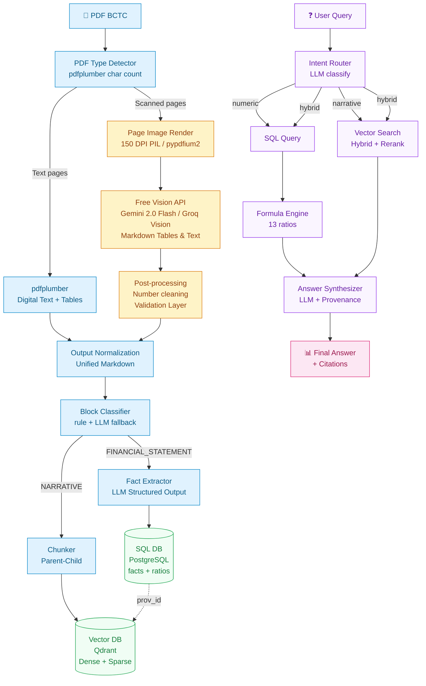

# 🏦 PROJECT PROPOSAL: FinAudit AI — v3.0
## Agent Hỏi đáp Báo cáo Tài chính cho Nhà đầu tư Cá nhân
### *(Hybrid SQL + Vector RAG with OCR for Financial Statement QA — Solo-buildable Capstone)*

---

## 1. MỤC TIÊU ĐỒ ÁN

Đây là dự án capstone với phạm vi được thiết kế thành **một lát cắt dọc hoàn chỉnh** — đủ chiều sâu kỹ thuật để viết thesis/capstone, vừa sức thực hiện một mình trong 10 tuần.

### 1.1. Bài toán

Nhà đầu tư cá nhân thường gặp khó khăn khi đọc Báo cáo tài chính (BCTC):
- **BCTC dài 100+ trang**, đầy thuật ngữ kế toán khó hiểu.
- **Thông tin phân tán**: số liệu nằm trong bảng, giải thích nằm trong thuyết minh.
- **Không biết bắt đầu từ đâu**: nên xem chỉ số nào, so sánh thế nào.
- **Không có công cụ hỏi đáp**: phải tự tra cứu thủ công, tốn thời gian.
- **BCTC không phải lúc nào cũng là PDF text-based**: nhiều BCTC (đặc biệt của SME, công ty chưa niêm yết) là **PDF scan** — không có text layer, cần OCR.

Các công cụ hiện có (Excel, website tài chính) chỉ cung cấp số liệu thô, không trả lời được câu hỏi kiểu:
- *"Doanh thu năm nay tăng bao nhiêu so với năm trước?"*
- *"Tại sao ROE giảm?"*
- *"Chính sách ghi nhận doanh thu của công ty là gì?"*

### 1.2. Giải pháp đề xuất

Xây dựng **FinAudit AI** — một hệ thống multi-agent sử dụng LLM để:

1. **Phân loại PDF** (text-based / scanned / hybrid) và xử lý tương ứng.
2. **Trích xuất** financial facts từ bảng BCTC → lưu vào **SQL**.
3. **Trích xuất** narrative (thuyết minh, chính sách kế toán, MD&A) → lưu vào **Vector DB**.
4. **Tính** financial ratios bằng Formula Engine deterministic.
5. **Routing** câu hỏi người dùng: numeric → SQL, narrative → Vector, hybrid → cả hai.
6. **Tổng hợp** câu trả lời kèm trích dẫn nguồn chính xác (trang, bảng, dòng).
7. **Giải thích** ratio bất thường bằng narrative từ thuyết minh.

### 1.3. Technical Contributions

| Contribution | Nội dung |
|---|---|
| **C1 — Two-Tier PDF Processing** | Pipeline xử lý 2 nhánh: pdfplumber cho Digital Native PDF, Free Vision API (Google Gemini 3.6 Flash) cho Scanned PDF |
| **C2 — Hybrid Storage Architecture** | Kiến trúc lưu trữ lai: SQL cho structured facts, Vector DB cho narrative chunks |
| **C3 — Block-Level Ingestion Classifier** | Pipeline phân loại từng block (table/narrative/policy) để route đến đúng storage |
| **C4 — OCR Post-processing for Financial Numbers** | Module làm sạch số OCR (nhầm 0/O, 1/l, dấu âm, đơn vị) — critical cho độ chính xác tài chính |
| **C5 — Unified Provenance ID** | Format `prov_id` chung cho cả SQL fact và Vector chunk, bao gồm `source="pdfplumber"|"ocr"` |
| **C6 — Intent-Based Query Router** | Agent phân loại câu hỏi thành `numeric` / `narrative` / `hybrid` |
| **C7 — Deterministic Formula Engine** | Python thuần tính 13 ratios, LLM không tự tính |
| **C8 — Provenance-Aware Answer Synthesis** | Mọi câu trả lời đều trích dẫn nguồn: `[Trang X, Bảng Y, Dòng Z]` |
| **C9 — Ablation Study on Storage + OCR Strategy** | So sánh: SQL-only / Vector-only / Hybrid / Hybrid+OCR |
| **C10 — Anti-GIGO Accounting Verifier** | Bộ tự kiểm toán số học loại trừ hoàn toàn rủi ro GIGO từ Vision LLM bằng cách xác thực 5 hệ phương trình kế toán cân đối Thông tư 200 trước khi lưu vào SQL |
| **C11 — LangGraph Ingestion & Triage Agent** | Agent trinh sát mục lục (TOC Inspector) điều phối phân luồng BCTC: BCTC cốt lõi gửi Vision LLM + Anti-GIGO, Thuyết minh gửi Local Fast OCR (RapidOCR/ONNX) offline 0 quota cho RAG |

---

## 2. BÀI TOÁN CỤ THỂ

### 2.1. Input
- 1–2 file PDF BCTC kiểm toán (Balance Sheet, Income Statement, Cash Flow Statement, Notes)
- **Loại PDF**: text-based, scanned, hoặc hybrid
- Câu hỏi của người dùng bằng ngôn ngữ tự nhiên (tiếng Việt)

### 2.2. Pipeline

```
┌─────────────────────────────────────────────────────────────────────┐
│                      INGESTION PIPELINE                             │
│                                                                     │
│  PDF BCTC                                                           │
│      ↓                                                              │
│  [1] PDF Type Detector (pdfplumber char count)                     │
│      ├── Text-based pages → pdfplumber                             │
│      ├── Scanned pages    → Free Vision API (OCR)                  │
│      └── Hybrid pages     → cả hai                                 │
│      ↓                                                              │
│  [2a] Text Extraction (pdfplumber)  [2b] Free Vision API (OCR)     │
│      │                                  │                          │
│      │                                  ├── Page Image Rendering   │
│      │                                  ├── Gemini 2.0 Flash/Groq  │
│      │                                  ├── Markdown Extraction    │
│      │                                  └── Post-processing        │
│      ↓                                  ↓                          │
│  [3] Output Normalization (unified Markdown)                       │
│      ↓                                                              │
│  [4] Block Classifier (rule-based + LLM fallback)                  │
│      ├── FINANCIAL_STATEMENT → Fact Extractor → SQL                │
│      ├── NUMERIC_NOTE        → Fact Extractor → SQL                │
│      ├── NARRATIVE           → Chunker        → Vector             │
│      ├── POLICY              → Chunker        → Vector             │
│      └── MIXED               → Cả hai                              │
│      ↓                                                              │
│  [5] SQL DB (facts)  +  [6] Vector DB (chunks)                     │
│      └────────── Unified prov_id ──────────┘                       │
└─────────────────────────────────────────────────────────────────────┘
                              ↓
┌─────────────────────────────────────────────────────────────────────┐
│                      QUERY PIPELINE                                 │
│                                                                     │
│  User Query                                                         │
│      ↓                                                              │
│  [7] Intent Router (LLM classify)                                  │
│      ├── numeric   → SQL Query                                     │
│      ├── narrative → Vector Search                                 │
│      └── hybrid    → SQL + Vector                                  │
│      ↓                                                              │
│  [8] Formula Engine (khi cần tính ratio)                           │
│      ↓                                                              │
│  [9] Answer Synthesizer (LLM + provenance)                         │
│      ↓                                                              │
│  Final Answer + Citations                                           │
└─────────────────────────────────────────────────────────────────────┘
```

### 2.3. Output

```
USER QUERY: "Doanh thu năm 2024 tăng bao nhiêu % so với 2023?
            Và nguyên nhân là gì?"

━━━━━━━━━━━━━━━━━━━━━━━━━━━━━━━━━━━━━━━━━━━━━━━━━━━━━━━━━

[1] NUMERIC ANSWER (từ SQL)

  Doanh thu thuần 2024: 3,200 tỷ VND  [Trang 8, Bảng 2, Dòng "Doanh thu thuần"]
  Doanh thu thuần 2023: 2,800 tỷ VND  [Trang 8, Bảng 2, Dòng "Doanh thu thuần"]

  → Tăng trưởng: +14.3%
  → Công thức: (3200 - 2800) / 2800 = 0.1428

[2] NARRATIVE EXPLANATION (từ Vector DB)

  Theo thuyết minh BCTC trang 22:
  "Doanh thu tăng chủ yếu do mở rộng thị trường miền Nam
   và ra mắt 3 dòng sản phẩm mới trong Q2/2024..."

  [Citation: Trang 22, Thuyết minh về doanh thu]

[3] PROVENANCE CHAIN

  Metric: revenue_growth_2024
    ├── Input 1: REVENUE_2024 = 3,200B
    │   └── Source: VNM_2024_p8_t2_r5 (SQL fact, pdfplumber)
    ├── Input 2: REVENUE_2023 = 2,800B
    │   └── Source: VNM_2024_p8_t2_r5 (SQL fact, pdfplumber)
    └── Explanation: VNM_2024_p22_s_revenue (Vector chunk, pdfplumber)
```

---

## 3. KIẾN TRÚC HỆ THỐNG

### 3.1. Sơ đồ tổng thể



### 3.2. LangGraph StateGraph

```
┌──────────────┐
│  Supervisor  │
└──────┬───────┘
       │
       ├──→ ┌─────────────────┐
       │    │  Router Node    │  ← Classify intent
       │    └────────┬────────┘
       │             ↓
       ├──→ ┌─────────────────┐
       │    │  SQL Node       │  ← Query facts (nếu numeric/hybrid)
       │    └────────┬────────┘
       │             ↓
       ├──→ ┌─────────────────┐
       │    │  Vector Node    │  ← Retrieval (nếu narrative/hybrid)
       │    └────────┬────────┘
       │             ↓
       ├──→ ┌─────────────────┐
       │    │  Formula Node   │  ← Tính ratio (nếu cần)
       │    └────────┬────────┘
       │             ↓
       └──→ ┌─────────────────┐
            │ Synthesize Node  │  ← Tổng hợp + citations
            └────────┬────────┘
                     ↓
            ┌─────────────────┐
            │  Final Answer   │
            └─────────────────┘
```

---

## 4. CHI TIẾT CÁC MODULE

### 4.1. Module 1: PDF Type Detector

**Input:** File PDF BCTC
**Output:** `list[PageClassification]`

**Đây là module quyết định routing cho từng trang.**

```python
def detect_pdf_pages(pdf_path: str) -> list[dict]:
    """
    Phát hiện loại từng trang trong PDF.
    Returns: list of {page: int, type: 'text'|'scanned', char_count: int}
    """
    results = []
    with pdfplumber.open(pdf_path) as pdf:
        for i, page in enumerate(pdf.pages):
            text = page.extract_text() or ""
            char_count = len(text.strip())
            
            if char_count >= 50:
                page_type = "text"
            else:
                page_type = "scanned"
                
            results.append({
                "page": i + 1,
                "type": page_type,
                "char_count": char_count
            })
    return results
```

**Lưu ý:** Không phải mọi trang scan đều cần OCR. Nếu trang scan chỉ là bìa hoặc hình ảnh minh họa, có thể bỏ qua. Chỉ OCR các trang scan có khả năng chứa nội dung tài chính.

---

### 4.2. Module 2a: Text Parser (pdfplumber)

**Input:** Text-based pages
**Output:** `list[ParsedBlock]`

**Công nghệ:** `pdfplumber`

**Xử lý đặc thù:**
- Bảng có header đa tầng (merged cells)
- Bảng trải qua nhiều trang
- Số âm trong ngoặc đơn `(1,234)` → `-1234`
- Đơn vị tiền tệ (triệu VND, tỷ VND) → chuẩn hóa về VND

```python
@dataclass
class ParsedBlock:
    block_id: str            # "p5_b1"
    block_type: Literal["table", "text"]
    page: int
    content: str             # markdown hoặc text
    bbox: tuple
    source: Literal["pdfplumber", "ocr"]
    metadata: dict
```

---

### 4.3. Module 2b: OCR Pipeline (Scanned Pages)

**Input:** Scanned pages
**Output:** `list[ParsedBlock]` (với `source="ocr"`)

Đây là module xử lý các trang PDF scan dạng ảnh — nơi `pdfplumber` không thể bóc tách do thiếu digital text layer.
Thay vì sử dụng các thư viện OCR offline nặng nề, khó cài đặt và tiêu tốn tài nguyên (PaddleOCR, VietOCR), FinAudit AI áp dụng kiến trúc **Free Vision Multimodal API** (Google Gemini 2.0 Flash / Groq Vision) kết hợp rendering hình ảnh tối ưu:

#### 2b.1. Page Image Rendering (pypdfium2 / PIL)

```python
import base64
import io
import pdfplumber

def render_page_to_base64(page: pdfplumber.page.Page, dpi: int = 150) -> str:
    """Render trang scan thành ảnh PNG và mã hóa Base64 để gửi tới Vision API."""
    pil_image = page.to_image(resolution=dpi).original
    buffered = io.BytesIO()
    pil_image.save(buffered, format="PNG")
    return base64.b64encode(buffered.getvalue()).decode("utf-8")
```

#### 2b.2. Free Vision API — Chiến lược bóc tách Multimodal

| Tiêu chí | Google Gemini 2.0 Flash | Groq Vision (Llama 3.2 Vision) |
|:---|:---|:---|
| **Chi phí** | **Hoàn toàn miễn phí** (15 RPM, 1500 RPD qua Google AI Studio) | **Miễn phí** (Free tier có sẵn trong Groq Cloud) |
| **Độ chính xác tiếng Việt** | Xuất sắc (hiểu sâu ngữ cảnh kế toán BCTC Việt Nam) | Tốt với cấu trúc bảng thông dụng |
| **Khả năng sinh Markdown Table** | Tái tạo trực tiếp chuẩn Markdown table với các cột/dòng nguyên bản | Tạo Markdown table chuẩn |
| **Cơ chế gọi** | REST API trực tiếp (`httpx`), không cần cài thêm package nặng | Python SDK `groq` có sẵn |

```python
import httpx

VISION_OCR_PROMPT = """Bạn là chuyên gia trích xuất Báo cáo tài chính (BCTC) Việt Nam.
Hãy bóc tách toàn bộ trang ảnh BCTC này:
1. Giữ nguyên bảng biểu dưới định dạng Markdown Table, bảo toàn 100% số liệu và dấu âm ngoặc đơn (ví dụ: (1.234)).
2. Trích xuất chính xác văn bản tiếng Việt có dấu.
3. Phân tách bảng và văn bản bằng dòng trống."""

def extract_scanned_page_with_gemini(img_b64: str, api_key: str) -> str:
    """Gọi Gemini 2.0 Flash trích xuất bảng và văn bản trực tiếp thành Markdown."""
    url = f"https://generativelanguage.googleapis.com/v1beta/models/gemini-2.0-flash:generateContent?key={api_key}"
    payload = {
        "contents": [{
            "parts": [
                {"text": VISION_OCR_PROMPT},
                {"inline_data": {"mime_type": "image/png", "data": img_b64}}
            ]
        }],
        "generationConfig": {"temperature": 0.0, "maxOutputTokens": 4096}
    }
    with httpx.Client(timeout=45.0) as client:
        res = client.post(url, json=payload)
        res.raise_for_status()
        return res.json()["candidates"][0]["content"]["parts"][0]["text"].strip()
```

#### 2b.3. Post-processing — Làm sạch số OCR

**Đây là bước cực kỳ quan trọng.** OCR có thể sai 5%, nhưng với bảng 10 số 6 chữ số, xác suất có ít nhất một lỗi là 95.4%.

**Các lỗi phổ biến:**

| Lỗi OCR | Ví dụ | Cách sửa |
|:---|:---|:---|
| Nhầm `0` → `O` | `1O,OOO` | Regex: `O` → `0` trong ngữ cảnh số |
| Nhầm `1` → `l` | `l,234` | Regex: `l` → `1` |
| Mất dấu phẩy | `1234567` thay vì `1,234,567` | Kiểm tra pattern số |
| Nhầm dấu âm | `(1,234)` → `1234` | Phát hiện ngoặc đơn |
| Nhầm đơn vị | `triệu` → `tỷ` | Kiểm tra context |

```python
import re

def clean_ocr_number(text: str) -> float | None:
    """Làm sạch số OCR và chuyển thành float."""
    if not text or not text.strip():
        return None
    
    text = text.strip()
    is_negative = text.startswith("(") and text.endswith(")")
    if is_negative:
        text = text[1:-1]
    
    # Sửa lỗi OCR phổ biến
    text = text.replace("O", "0").replace("o", "0")
    text = text.replace("l", "1").replace("I", "1")
    text = text.replace(" ", "")
    text = re.sub(r"[^\d,.-]", "", text)
    
    # Chuẩn hóa dấu phân cách
    if text.count(".") > 1:
        text = text.replace(".", "")
    elif text.count(",") > 1:
        text = text.replace(",", "")
    
    try:
        value = float(text)
        return -value if is_negative else value
    except ValueError:
        return None
```

#### 2b.4. Validation Layer

```python
def validate_ocr_result(table_data: dict, expected_total: float | None = None) -> dict:
    """Kiểm tra tính hợp lệ của bảng OCR."""
    issues = []
    
    if expected_total:
        calculated = sum(row['value'] for row in table_data['rows'])
        if abs(calculated - expected_total) > 0.01 * expected_total:
            issues.append(f"Tổng không khớp: {calculated} vs {expected_total}")
    
    for row in table_data['rows']:
        if row['concept'] in ['TOTAL_ASSETS', 'REVENUE'] and row['value'] < 0:
            issues.append(f"{row['concept']} âm bất thường: {row['value']}")
    
    return {"data": table_data, "issues": issues, "is_valid": len(issues) == 0}
```

---

### 4.4. Module 3: Output Normalization

**Input:** ParsedBlocks từ cả pdfplumber và OCR
**Output:** Unified Markdown document

```python
def normalize_output(text_blocks: list, ocr_blocks: list) -> list[ParsedBlock]:
    """Hợp nhất kết quả từ text extraction và OCR về cùng format."""
    all_blocks = []
    
    for block in text_blocks:
        block.source = "pdfplumber"
        all_blocks.append(block)
    
    for block in ocr_blocks:
        block.source = "ocr"
        all_blocks.append(block)
    
    all_blocks.sort(key=lambda b: (b.page, b.block_id))
    return all_blocks
```

---

### 4.5. Module 4: Block Classifier

**Input:** `list[ParsedBlock]`
**Output:** `list[ClassifiedBlock]` với `block_type` và `target_storage`

**Đây là module quyết định block nào vào SQL, block nào vào Vector.**

#### Taxonomy block

| Loại block | Ví dụ | Đích đến |
|:---|:---|:---|
| **FINANCIAL_STATEMENT** | Bảng Cân đối, KQKD, LCTT | **SQL** (facts) + **Vector** (markdown để trace) |
| **NUMERIC_NOTE** | "Chi tiết hàng tồn kho", "Chi tiết phải thu" | **SQL** (facts) |
| **NARRATIVE** | Đoạn văn thuyết minh | **Vector** |
| **POLICY** | "Chính sách ghi nhận doanh thu" | **Vector** |
| **MD&A** | Nhận xét ban lãnh đạo | **Vector** |
| **MIXED** | Bảng có đoạn văn dẫn | **Cả hai** |

#### Classifier logic

```python
def classify_block(block: ParsedBlock) -> ClassifiedBlock:
    # Rule-based (80% cases)
    if block.block_type == "table":
        header = block.get_header_row().lower()
        
        if any(kw in header for kw in ["chỉ tiêu", "kỳ này", "kỳ trước"]):
            return ClassifiedBlock(
                block=block,
                block_type="FINANCIAL_STATEMENT",
                target=["sql", "vector"]
            )
        
        if any(kw in header for kw in ["stt", "đối tượng", "số tiền"]):
            return ClassifiedBlock(
                block=block,
                block_type="NUMERIC_NOTE",
                target=["sql"]
            )
    
    if block.block_type == "text":
        if is_policy_text(block.content):
            return ClassifiedBlock(
                block=block,
                block_type="POLICY",
                target=["vector"]
            )
        
        return ClassifiedBlock(
            block=block,
            block_type="NARRATIVE",
            target=["vector"]
        )
    
    # LLM fallback (20% cases)
    return llm_classify(block)
```

#### Section Detection cho Parent Chunking

**Section** là đơn vị ngữ nghĩa (không phải trang):

```python
def detect_sections(blocks: list[ClassifiedBlock]) -> list[Section]:
    sections = []
    current = None
    
    for block in blocks:
        if is_heading(block):  # "THUYẾT MINH...", "Chính sách kế toán..."
            if current:
                sections.append(current)
            current = Section(
                id=f"{company}_{year}_s_{slugify(block.content)}",
                title=block.content,
                blocks=[]
            )
        if current:
            current.blocks.append(block)
    
    if current:
        sections.append(current)
    return sections
```

---

### 4.6. Module 5: Financial Fact Extractor

**Input:** `ClassifiedBlock` với `target=["sql"]`
**Output:** `list[FinancialFact]`

**Pydantic Schema:**

```python
class FinancialFact(BaseModel):
    id: str                   # "VNM_2024_p5_t1_r3"
    prov_id: str              # "VNM_2024_p5_t1_r3"
    concept: str              # "TOTAL_ASSETS"
    raw_label: str            # "Tổng tài sản"
    value: float
    unit: str                 # "VND"
    period: str               # "2024"
    period_type: Literal["current", "previous"]
    company: str
    year: int
    page: int
    table_id: str
    row_label: str
    confidence: float
    extraction_method: Literal["table", "text", "llm_fallback"]
    source: Literal["pdfplumber", "ocr"]   # ← MỚI
```

**Financial Ontology (Vietnamese → Canonical):**

| Canonical Concept | Aliases tiếng Việt |
|:---|:---|
| `TOTAL_ASSETS` | "Tổng tài sản", "TỔNG CỘNG TÀI SẢN" |
| `CURRENT_ASSETS` | "Tài sản ngắn hạn", "TÀI SẢN NGẮN HẠN" |
| `TOTAL_LIABILITIES` | "Tổng nợ phải trả", "Nợ phải trả" |
| `TOTAL_EQUITY` | "Vốn chủ sở hữu", "VỐN CHỦ SỞ HỮU" |
| `REVENUE` | "Doanh thu thuần", "Doanh thu thuần về bán hàng và cung cấp dịch vụ" |
| `NET_PROFIT` | "Lợi nhuận sau thuế" |
| ... | ... |

#### 4.6.1. Anti-GIGO Accounting Invariants Verifier (Chốt chặn tự kiểm toán số học)

Một trong những rủi ro lớn nhất khi dùng LLM hoặc Vision OCR trích xuất bảng biểu tài chính là **GIGO (Garbage In, Garbage Out)**:
- OCR nhận diện nhầm số (ví dụ: `1` thành `7`, rớt số `0`, nhầm dấu phẩy).
- Vision LLM bị ảo giác (hallucination) hoặc tráo đổi dòng, làm sai lệch số liệu tài chính.

Để giải quyết triệt để rủi ro này, FinAudit AI triển khai **Accounting Invariants Verifier** — hệ thống kiểm toán số học tự động bằng mã Python thuần túy dựa trên các đẳng thức cân đối bắt buộc của Chuẩn mực Kế toán Việt Nam (Thông tư 200/2014/TT-BTC):

1. **Cân đối Tổng thể Bảng Cân đối Kế toán:**
   $$\text{Mã 270 (Tổng cộng tài sản)} \equiv \text{Mã 440 (Tổng cộng nguồn vốn)}$$
2. **Cơ cấu Tài sản:**
   $$\text{Mã 270 (Tổng tài sản)} = \text{Mã 100 (Tài sản ngắn hạn)} + \text{Mã 200 (Tài sản dài hạn)}$$
3. **Cộng dồn Tài sản ngắn hạn:**
   $$\text{Mã 100} = \text{Mã 110 (Tiền)} + \text{Mã 120 (Đầu tư)} + \text{Mã 130 (Phải thu)} + \text{Mã 140 (Tồn kho)} + \text{Mã 150 (Khác)}$$
4. **Cơ cấu Nguồn vốn:**
   $$\text{Mã 440 (Tổng nguồn vốn)} = \text{Mã 300 (Nợ phải trả)} + \text{Mã 400 (Vốn chủ sở hữu)}$$
5. **Cân đối Lợi nhuận gộp:**
   $$\text{Mã 20 (Lợi nhuận gộp)} = \text{Mã 10 (Doanh thu thuần)} - \text{Mã 11 (Giá vốn hàng bán)}$$

Mỗi `FinancialFact` sau khi trích xuất sẽ được gán nhãn:
- `VERIFIED`: Thuộc phương trình kế toán cân khớp hoàn toàn (sai số do làm tròn $\le 0.01\%$).
- `DISCREPANCY`: Phát hiện sai lệch số học trong phương trình; hệ thống ghi log chi tiết độ lệch và gắn cờ cảnh báo cho Agent.
- `UNCHECKED`: Các khoản mục thuyết minh đơn lẻ không tham gia phương trình cộng dồn.

#### 4.6.2. LangGraph Ingestion & Triage Agent (Phân luồng đa phương thức BCTC)

Để giải quyết mâu thuẫn giữa **chất lượng trích xuất số liệu tuyệt đối** và **chi phí / hạn mức quota API** khi xử lý các tài liệu BCTC scan dài (40–60 trang), FinAudit AI xây dựng một Agent chuyên trách ngay từ khâu Ingestion bằng LangGraph (`StateGraph`):

1. **Trinh sát Mục lục (TOC Inspector)**:
   - Tự động quét 3–5 trang đầu tiên của file PDF để định vị bảng Mục lục (`NỘI DUNG | TRANG`).
   - Tự động tính toán Page Offset giữa số trang in và số trang PDF vật lý (`page_offset = toc_pdf_page - 1`).
   - Tách tài liệu thành 2 dải trang riêng biệt: Báo cáo tài chính cốt lõi (Core Statements, ~5-6 trang) và Thuyết minh BCTC (Notes, ~40 trang).

2. **Chiến lược phân luồng đa phương thức (Dual-Engine Routing)**:
   - **Nhánh 1 — Core Statements (Độ chính xác tuyệt đối)**: Gửi tới **Vision LLM** (`gemini-flash-latest` / `gemini-3.5-flash-lite` với cơ chế Fast-Failover & Checkpoint Cache) để bóc tách nguyên vẹn các bảng biểu, đưa qua `FinancialFactExtractor`, kiểm toán bằng `AccountingVerifier` và nạp vào SQLite.
   - **Nhánh 2 — Thuyết minh BCTC (Text cho RAG)**: Gửi tới **Local Offline Vietnamese OCR Engine** (kết hợp **PaddleOCR DBNet** phát hiện bounding boxes và **VietOCR Seq2Seq/Transformer** nhận diện tiếng Việt có dấu chuẩn xác 100%, **chạy 100% offline trên CPU, 0 tốn quota API / 0 tokens**, tốc độ ~0.15s/dòng) để bóc tách toàn bộ văn bản và ghi chú phục vụ Semantic Chunking và Vector RAG.
   - Bổ sung cơ chế Fallback sang **RapidOCR ONNX** khi cần thiết.

3. **Hợp nhất dữ liệu (Aggregator & Compiler)**:
   - Tự động gắn nhãn nguồn gốc (`source="ocr"` vs `source="local_ocr"`), phát hiện Section ngữ nghĩa, xuất file Markdown hoàn chỉnh và tổng hợp metrics kiểm toán.

---

### 4.7. Module 6: SQL Database (SQLite / PostgreSQL)

**DDL Schema thực tế:**

```sql
CREATE TABLE IF NOT EXISTS companies (
    code TEXT PRIMARY KEY,
    name TEXT,
    industry TEXT,
    created_at TIMESTAMP DEFAULT CURRENT_TIMESTAMP
);

CREATE TABLE IF NOT EXISTS financial_statements (
    id TEXT PRIMARY KEY,
    company TEXT NOT NULL,
    year INTEGER NOT NULL,
    period TEXT NOT NULL,
    statement_type TEXT DEFAULT 'CONSOLIDATED',
    source_file TEXT,
    is_balanced INTEGER DEFAULT 1,
    total_checks INTEGER DEFAULT 0,
    passed_checks TEXT DEFAULT '[]',
    failed_checks TEXT DEFAULT '[]',
    created_at TIMESTAMP DEFAULT CURRENT_TIMESTAMP,
    FOREIGN KEY (company) REFERENCES companies(code)
);

CREATE TABLE IF NOT EXISTS financial_facts (
    id TEXT PRIMARY KEY,
    prov_id TEXT NOT NULL,
    company TEXT NOT NULL,
    year INTEGER NOT NULL,
    period TEXT NOT NULL,
    period_type TEXT NOT NULL,
    concept TEXT NOT NULL,
    standard_code TEXT,
    raw_label TEXT NOT NULL,
    value REAL NOT NULL,
    unit TEXT DEFAULT 'VND',
    page INTEGER,
    table_id TEXT,
    source TEXT DEFAULT 'pdfplumber',
    confidence REAL DEFAULT 1.0,
    verification_status TEXT DEFAULT 'UNCHECKED',  -- 'VERIFIED' | 'DISCREPANCY' | 'UNCHECKED'
    verification_detail TEXT,
    created_at TIMESTAMP DEFAULT CURRENT_TIMESTAMP,
    FOREIGN KEY (company) REFERENCES companies(code)
);

CREATE TABLE IF NOT EXISTS financial_ratios (
    id TEXT PRIMARY KEY,
    company TEXT NOT NULL,
    year INTEGER NOT NULL,
    ratio_name TEXT NOT NULL,
    ratio_category TEXT NOT NULL,
    value REAL NOT NULL,
    formula TEXT NOT NULL,
    input_prov_ids TEXT DEFAULT '[]',
    is_deterministic INTEGER DEFAULT 1,
    created_at TIMESTAMP DEFAULT CURRENT_TIMESTAMP,
    FOREIGN KEY (company) REFERENCES companies(code)
);
```

CREATE TABLE provenance (
    prov_id TEXT PRIMARY KEY,
    source_type TEXT,           -- "sql" | "vector"
    source_id TEXT,
    extraction_source TEXT,     -- "pdfplumber" | "ocr"  ← MỚI
    page INTEGER,
    table_id TEXT,
    row_label TEXT,
    company TEXT,
    year INTEGER
);
```

---

### 4.8. Module 7: Vector Database

**Collection:** `bctc_chunks`

**Payload:**

```python
{
    "prov_id": "VNM_2024_p22_s_revenue_p3",
    "doc_type": "BCTC",
    "company": "VNM",
    "year": 2024,
    "section_id": "VNM_2024_s_revenue",
    "content_type": "narrative",  # narrative | policy | md&a | auditor
    "page": 22,
    "parent_id": "VNM_2024_s_revenue",
    "chunk_type": "child",        # parent | child
    "block_type": "text",
    "source": "pdfplumber",       # ← MỚI
    "text": "Doanh thu tăng chủ yếu do mở rộng thị trường miền Nam...",
    "linked_facts": ["VNM_2024_p8_t2_r5"]
}
```

**Parent-Child Structure:**

| Cấp | Đơn vị | Mục đích |
|:---|:---|:---|
| **Parent** | Section | Giữ ngữ cảnh lớn khi cần |
| **Child** | Paragraph hoặc table markdown | Retrieval chính xác |

**Indexing:**
- Dense: `BAAI/bge-m3` (1024-dim)
- Sparse: BM25
- Fusion: RRF (Qdrant Prefetch API)

---

### 4.9. Module 8: Unified Provenance ID

**Format:**

```
{company}_{year}_p{page}_t{table}_{r|p}{index}
```

**Ví dụ:**
- SQL fact: `VNM_2024_p8_t2_r5` (Doanh thu, dòng 5 bảng 2 trang 8)
- Vector child: `VNM_2024_p22_s_revenue_p3` (đoạn 3 section revenue trang 22)
- Vector parent: `VNM_2024_s_revenue`

**Metadata bổ sung:** `source: "pdfplumber" | "ocr"` — cho phép trace nguồn gốc.

---

### 4.10. Module 9: Formula Engine

**13 ratios deterministic:**

| Nhóm | Tool | Công thức |
|:---|:---|:---|
| **Thanh khoản** | `current_ratio` | Current Assets / Current Liabilities |
| | `quick_ratio` | (CA - Inventory) / CL |
| | `cash_ratio` | Cash / CL |
| **Đòn bẩy** | `debt_to_equity` | Total Debt / Total Equity |
| | `debt_to_assets` | Total Debt / Total Assets |
| | `interest_coverage` | EBIT / Interest Expense |
| **Sinh lời** | `net_profit_margin` | Net Profit / Revenue |
| | `roa` | Net Profit / Total Assets |
| | `roe` | Net Profit / Total Equity |
| | `gross_margin` | Gross Profit / Revenue |
| | `ebitda_margin` | EBITDA / Revenue |
| **Hiệu quả** | `inventory_turnover` | COGS / Avg Inventory |
| | `receivables_turnover` | Revenue / Avg Receivables |
| **Tổng hợp** | `altman_z_score` | 1.2X1 + 1.4X2 + 3.3X3 + 0.6X4 + 1.0X5 |

**Nguyên tắc:** LLM chọn công thức và tham số, Python tính. LLM không bao giờ tự tính.

---

### 4.11. Module 10: Intent Router (Query Time)

**Input:** User query
**Output:** `QueryIntent`

```python
class QueryIntent(BaseModel):
    intent: Literal["numeric", "narrative", "hybrid"]
    concepts: list[str]          # ["REVENUE", "NET_PROFIT"]
    periods: list[str]           # ["2024", "2023"]
    narrative_topic: str | None  # "chính sách ghi nhận doanh thu"
    needs_comparison: bool
    needs_calculation: bool
```

**Routing logic:**

```
                    ┌─────────────────┐
                    │  User Query     │
                    └────────┬────────┘
                             ↓
                    ┌─────────────────┐
                    │  Router Node    │
                    └────────┬────────┘
                             ↓
              ┌──────────────┼──────────────┐
              ↓              ↓              ↓
        ┌──────────┐   ┌──────────┐   ┌──────────┐
        │ NUMERIC  │   │NARRATIVE │   │  HYBRID  │
        └────┬─────┘   └────┬─────┘   └────┬─────┘
             ↓              ↓              ↓
        ┌─────────┐    ┌─────────┐    ┌──────────┐
        │ SQL     │    │ Vector  │    │ SQL +    │
        │ Query   │    │ Search  │    │ Vector   │
        └─────────┘    └─────────┘    └──────────┘
```

---

### 4.12. Module 11: Answer Synthesizer

**Input:** SQL results + Vector chunks + Ratio results
**Output:** Final answer + citations

**Nguyên tắc:**
- Mọi con số phải có citation `[Trang X, Bảng Y, Dòng Z]`
- Mọi giải thích phải có citation `[Trang X, Thuyết minh]`
- Nếu fact đến từ OCR → ghi rõ `[Nguồn: OCR]`
- Nếu thiếu dữ liệu → ghi rõ `[DỮ LIỆU KHÔNG TÌM THẤY]`

---

## 5. TECH STACK

| Tầng | Công nghệ | Ghi chú |
|:---|:---|:---|
| **LLM** | Groq `openai/gpt-oss-120b` (dev) → Claude Haiku (prod) | Structured output |
| **Multi-Agent** | `LangGraph` StateGraph | Orchestration |
| **PDF Type Detection** | `pdfplumber` (char count) | **MỚI** |
| **PDF Parsing (text)** | `pdfplumber` | Text + Table → Markdown |
| **PDF Parsing (scan)** | `pypdfium2` / `Pillow` | Render trang scan sang ảnh 150 DPI |
| **Vision OCR Engine** | `Google Gemini 2.0 Flash` / `Groq Vision` | **MỚI** — Free Vision API trích xuất Markdown Table & Text |
| **OCR Post-processing** | Python regex + rules | **MỚI** — Number cleaning, validation |
| **Fact Extraction** | Pydantic structured output | LLM trả về typed schema |
| **Formula Engine** | Python thuần | 13 ratios deterministic |
| **SQL DB** | `PostgreSQL` (prod) / `SQLite` (dev) | Facts, ratios, provenance |
| **Vector DB** | `Qdrant` Hybrid Search | Dense (BGE-M3) + Sparse (BM25) + RRF |
| **Embedding** | `BAAI/bge-m3` | 1024-dim |
| **Reranker** | `BAAI/bge-reranker-v2-m3` | Cross-encoder |
| **Evaluation** | Ragas + custom metrics | Numeric Accuracy, Provenance Accuracy, OCR CER |
| **Observability** | `Langfuse` | Traces + cost tracking |
| **Config** | `pydantic-settings` | Singleton `get_settings()` |

**Dependencies Ingestion:**

```toml
[project.dependencies]
pdfplumber = "^0.11.0"         # Bóc tách native PDF + render ảnh qua pypdfium2
httpx = "^0.27.0"              # Gọi Gemini 2.0 Flash Vision API trực tiếp
groq = "^0.9.0"                # Gọi Groq Vision API (Llama 3.2 Vision)
pillow = "^10.0.0"             # Xử lý định dạng ảnh Base64
pydantic = "^2.0"              # Data contracts & validation
pydantic-settings = "^2.0"     # Quản lý cấu hình tập trung
```

**Ưu điểm môi trường:** Sử dụng Free Vision API loại bỏ hoàn toàn các phụ thuộc C++ nặng nề và phức tạp của PaddlePaddle, PyTorch hay VietOCR, tương thích hoàn hảo trên mọi hệ điều hành (Windows, Linux, macOS) với Python `>=3.11`.

---

## 6. LỘ TRÌNH 10 TUẦN

---

### 🔵 GIAI ĐOẠN 1 — Tuần 1
**PDF Type Detector + Text Parser + Vision OCR Pipeline**

#### Mục tiêu
Xây dựng nền tảng xử lý cả text-based và scanned PDF.

#### Kỹ năng cốt lõi
- **PDF Type Detector**: `pdfplumber` char count per page (ngưỡng 50 ký tự)
- **Text Parser**: `pdfplumber` → digital text + tables → Markdown
- **Vision OCR Pipeline**: Page image rendering (150 DPI) + Google Gemini 2.0 Flash / Groq Vision
- **Post-processing**: Làm sạch số tài chính (clean_ocr_number), validation layer (validate_ocr_table)

#### Deliverables
- `src/parser/pdf_type_detector.py`
- `src/parser/text_parser.py`
- `src/parser/ocr_pipeline.py` (VisionOCRPipeline)
- `src/parser/ocr_postprocess.py`
- `tests/test_type_detector.py`, `tests/test_ocr.py`

---

### 🟢 GIAI ĐOẠN 2 — Tuần 2
**Output Normalization + Block Classifier**

#### Mục tiêu
Chuẩn hóa output từ hai nhánh và phân loại block.

#### Kỹ năng cốt lõi
- **Output Normalization**: Hợp nhất pdfplumber + OCR → unified Markdown
- **Block Classifier**: Rule-based (80%) + LLM fallback (20%)
- **Section Detection**: Heading-based section splitting
- **Output**: `ClassifiedBlock` với `target=["sql"]`, `["vector"]`, hoặc cả hai

#### Deliverables
- `src/parser/normalizer.py`
- `src/parser/block_classifier.py`
- `src/parser/section_detector.py`
- `tests/test_classifier.py`

---

### 🟡 GIAI ĐOẠN 3 — Tuần 3
**Financial Fact Extractor + SQL DB**

#### Mục tiêu
Trích xuất facts từ blocks và lưu vào SQL.

#### Kỹ năng cốt lõi
- **LLM Structured Output**: Pydantic schema `FinancialFact`
- **Financial Ontology**: Map alias tiếng Việt → canonical concept
- **SQL Schema**: `facts`, `ratios`, `provenance` tables
- **Extraction Strategy**: Regex (table) → LLM fallback (text)
- **Source Tracking**: `source="pdfplumber"|"ocr"`

#### Deliverables
- `src/extractor/fact_extractor.py`
- `src/extractor/ontology.py`
- `src/storage/sql_db.py`
- `tests/test_extractor.py`, `tests/test_sql.py`

---

### 🟠 GIAI ĐOẠN 4 — Tuần 4
**Chunker + Vector DB**

#### Mục tiêu
Chunk narrative blocks và index vào Vector DB.

#### Kỹ năng cốt lõi
- **Parent-Child Chunking**: Parent = section, Child = paragraph
- **Qdrant Setup**: Dense (BGE-M3) + Sparse (BM25)
- **Hybrid Search**: RRF fusion
- **Payload Design**: `prov_id`, `linked_facts`, `content_type`, `source`

#### Deliverables
- `src/chunker/parent_child.py`
- `src/storage/vector_db.py`
- `tests/test_chunker.py`, `tests/test_vector.py`

---

### 🔴 GIAI ĐOẠN 5 — Tuần 5
**Formula Engine + Provenance Builder**

#### Mục tiêu
Xây dựng Formula Engine deterministic và Provenance Builder.

#### Kỹ năng cốt lõi
- **13 Ratios**: Thanh khoản, đòn bẩy, sinh lời, hiệu quả, Altman Z
- **Input Resolution**: Từ Fact Store → tham số cho công thức
- **Provenance Builder**: Metric → Inputs → Facts → Page/Table/Row + Source
- **Unified prov_id**: Cross-reference SQL ↔ Vector

#### Deliverables
- `src/formula/engine.py`
- `src/formula/ratios.py`
- `src/provenance/builder.py`
- `tests/test_formula.py`, `tests/test_provenance.py`

---

### 🟣 GIAI ĐOẠN 6 — Tuần 6
**Intent Router + LangGraph Integration**

#### Mục tiêu
Xây dựng Router Node và tích hợp pipeline.

#### Kỹ năng cốt lõi
- **Intent Router**: LLM classify → numeric / narrative / hybrid
- **LangGraph StateGraph**: Supervisor → Router → SQL/Vector → Formula → Synthesize
- **Conditional Routing**: Dựa trên intent
- **State Management**: Facts, chunks, ratios trong state

#### Deliverables
- `src/agents/router.py`
- `src/graph/state_graph.py`
- `tests/test_router.py`, `tests/test_graph.py`

---

### 🟤 GIAI ĐOẠN 7 — Tuần 7
**Answer Synthesizer + Citation + CLI Demo**

#### Mục tiêu
Tổng hợp câu trả lời với citations và hoàn thiện CLI.

#### Kỹ năng cốt lõi
- **Citation Extraction**: Từ facts và chunks → `[Trang X, Bảng Y, Dòng Z]`
- **Source Attribution**: Ghi rõ `[Nguồn: OCR]` nếu fact đến từ scan
- **Data Gaps**: Liệt kê thông tin không tìm thấy
- **CLI**: `python scripts/ask_bctc.py --pdf bctc.pdf --query "Doanh thu 2024?"`
- **Integration Test**: Full pipeline với Qdrant + PostgreSQL Docker

#### Deliverables
- `src/agents/synthesizer.py`
- `src/report/citation.py`
- `scripts/ask_bctc.py`
- `tests/test_synthesizer.py`, `tests/test_integration.py`

---

### ⚪ GIAI ĐOẠN 8 — Tuần 8
**Golden Dataset + OCR Test Set**

#### Mục tiêu
Xây dựng benchmark đánh giá bao gồm cả test set cho OCR.

#### Kỹ năng cốt lõi
- **Golden Dataset**: 50–100 câu hỏi với ground truth
  - Numeric Q: đáp án là số
  - Narrative Q: đáp án là đoạn văn + citation
  - Hybrid Q: kết hợp cả hai
- **OCR Test Set**: 5–10 BCTC scan với ground truth text
- **Ground Truth Format**: `{question, intent, required_facts, gold_answer, gold_evidence}`
- **Auto-generation**: Dùng LLM sinh câu hỏi từ BCTC, verify thủ công

#### Deliverables
- `data/golden_dataset/` (JSON)
- `data/ocr_test_set/` (scanned PDFs + ground truth)
- `scripts/build_benchmark.py`

---

### 🟫 GIAI ĐOẠN 9 — Tuần 9
**Evaluation Suite + Ablation Study**

#### Mục tiêu
Đánh giá hệ thống và chứng minh hiệu quả của Hybrid + OCR approach.

#### Evaluation Metrics

| Layer | Metric |
|:---|:---|
| **OCR** | Character Error Rate (CER), Number Accuracy |
| **Numeric** | Numeric Accuracy (số đúng) |
| **Retrieval** | Recall@K, MRR, nDCG |
| **Citation** | Provenance Accuracy (trang/bảng/dòng đúng) |
| **Generation** | Faithfulness (Ragas), Answer Relevancy |
| **End-to-End** | Human rubric (1–5) |

#### Ablation Study

```
S1: Vector-only (all chunks in Vector DB)
S2: SQL-only (all facts in SQL, no narrative)
S3: Hybrid without routing (always query both)
S4: Hybrid with routing (proposed, text-based PDF only)
S5: Hybrid with routing + OCR (proposed, full pipeline)
```

Mục tiêu chứng minh: **S5 > S4 > S3 > S2 > S1** về accuracy và coverage.

#### Deliverables
- `src/evaluation/metrics.py`
- `src/evaluation/ocr_metrics.py`
- `src/evaluation/ablation.py`
- `reports/ablation_results.md`

---

### ⚫ GIAI ĐOẠN 10 — Tuần 10
**Documentation, Demo & Final Polish**

#### Mục tiêu
Hoàn thiện capstone và portfolio.

#### Kỹ năng cốt lõi
- **Thesis/Capstone Report**: Problem, Architecture, Results, Limitations
- **Demo Video**: 3–5 phút end-to-end (bao gồm cả scan PDF)
- **README**: Problem, Architecture, Results, Design Decisions, Limitations
- **Code Cleanup**: Type hints, docstrings, test coverage ≥ 80%
- **Final Integration Test**: Full pipeline với Docker

#### Deliverables
- `docs/thesis.pdf`
- `docs/demo.mp4`
- `README.md`
- Final report

---

## 7. PHẠM VI & CAM KẾT

| Hạng mục | Trong scope | Ngoài scope (Phase sau) |
|----------|------------|------------------------|
| PDF type detection | ✅ | |
| Text extraction (pdfplumber) | ✅ | |
| Vision OCR API (Gemini / Groq Vision) | ✅ | |
| OCR post-processing | ✅ | |
| Block classification | ✅ | |
| SQL DB (facts + ratios) | ✅ | |
| Vector DB (narrative chunks) | ✅ | |
| 13 financial ratios | ✅ | |
| Intent routing | ✅ | |
| Provenance chain đầy đủ | ✅ | |
| Multi-period (2–3 năm) | ✅ | |
| CLI + JSON output | ✅ | |
| Ablation study S1–S5 | ✅ | |
| FastAPI + UI | | ❌ Phase C |
| Multi-company comparison | | ❌ Phase C |
| Web search integration | | ❌ Phase C |
| CI/CD + VPS deploy | | ❌ Phase C |

---

## 8. TIÊU CHÍ HOÀN THÀNH (DEFINITION OF DONE)

### Functional
- [ ] PDF Type Detector phân loại đúng ≥ 95% pages
- [ ] Text Parser extract ≥ 40 facts từ text-based PDF
- [ ] OCR Pipeline extract ≥ 30 facts từ scanned PDF
- [ ] OCR number cleaning accuracy ≥ 90%
- [ ] Block Classifier phân loại đúng ≥ 90% blocks
- [ ] Router phân loại đúng intent ≥ 90% test cases
- [ ] Tính đủ 13 financial ratios từ extracted facts
- [ ] Mỗi câu trả lời có citation `[Trang X, Bảng Y, Dòng Z]`
- [ ] Provenance chain: Metric → Facts → Source (pdfplumber/OCR)
- [ ] CLI `python scripts/ask_bctc.py --query "..."` chạy end-to-end

### Research
- [ ] Golden dataset ≥ 50 câu hỏi (text-based)
- [ ] OCR test set ≥ 5 BCTC scan
- [ ] Ablation study S1–S5 hoàn chỉnh
- [ ] Numeric Accuracy ≥ 0.90
- [ ] Provenance Accuracy ≥ 0.85
- [ ] Faithfulness ≥ 0.80 (Ragas)
- [ ] Router Accuracy ≥ 0.90
- [ ] OCR Character Error Rate ≤ 5%

### Tests
- [ ] `pytest tests/ -v -m "not integration"` → tất cả PASS
- [ ] `pytest tests/ -v` (full, cần Docker) → tất cả PASS
- [ ] Test coverage ≥ 80%

---

## 9. CẤU TRÚC THƯ MỤC DỰ ÁN

```
fin-audit-ai/
├── src/
│   ├── parser/
│   │   ├── pdf_type_detector.py      ← MỚI
│   │   ├── text_parser.py            ← Đổi tên từ pdf_parser.py
│   │   ├── ocr_pipeline.py           ← MỚI
│   │   ├── ocr_postprocess.py        ← MỚI
│   │   ├── normalizer.py             ← MỚI
│   │   ├── block_classifier.py
│   │   └── section_detector.py
│   ├── extractor/
│   │   ├── fact_extractor.py
│   │   └── ontology.py
│   ├── chunker/
│   │   └── parent_child.py
│   ├── storage/
│   │   ├── sql_db.py
│   │   └── vector_db.py
│   ├── formula/
│   │   ├── engine.py
│   │   └── ratios.py
│   ├── provenance/
│   │   └── builder.py
│   ├── agents/
│   │   ├── router.py
│   │   └── synthesizer.py
│   ├── graph/
│   │   └── state_graph.py
│   ├── report/
│   │   └── citation.py
│   └── evaluation/
│       ├── metrics.py
│       ├── ocr_metrics.py            ← MỚI
│       └── ablation.py
├── scripts/
│   ├── ingest_bctc.py
│   ├── ask_bctc.py
│   ├── build_benchmark.py
│   └── run_ablation.py
├── tests/
│   ├── test_type_detector.py         ← MỚI
│   ├── test_text_parser.py
│   ├── test_ocr.py                   ← MỚI
│   ├── test_classifier.py
│   ├── test_extractor.py
│   ├── test_chunker.py
│   ├── test_sql.py
│   ├── test_vector.py
│   ├── test_formula.py
│   ├── test_provenance.py
│   ├── test_router.py
│   ├── test_synthesizer.py
│   └── test_integration.py
├── data/
│   ├── bctc_pdfs/
│   │   ├── text_based/               ← MỚI
│   │   └── scanned/                  ← MỚI
│   ├── golden_dataset/
│   └── ocr_test_set/                 ← MỚI
├── docs/
│   ├── thesis.pdf
│   └── demo.mp4
├── docker-compose.yml
├── README.md
└── pyproject.toml
```

---

## 10. TẠI SAO ĐỀ TÀI NÀY DỄ EVALUATION?

| Yếu tố | Cách truyền thống | FinAudit AI |
|:---|:---|:---|
| **Ground truth** | Annotation thủ công | **Tự động sinh + verify thủ công** |
| **Numeric metric** | Chủ quan | **Exact match** (số học) |
| **Provenance metric** | Không có | **Page/Table/Row accuracy** |
| **Router metric** | Không có | **Intent classification F1** |
| **OCR metric** | Không có | **Character Error Rate (CER)** |
| **Ablation** | Khó so sánh | **5 configurations rõ ràng** |
| **Reproducibility** | Phụ thuộc annotator | **Script tự động** |

---

## 11. RỦI RO & GIẢI PHÁP

| Rủi ro | Mức độ | Giải pháp |
|:---|:---|:---|
| PDF Type Detector phân loại sai | Thấp | Threshold 50 chars; test trên nhiều loại PDF |
| Rate-limit Free Vision API | Trung bình | Cơ chế tự động fallback giữa Gemini (15 RPM) và Groq Vision; retry exponential backoff |
| OCR number cleaning không chính xác | Cao | Validation layer; cross-check với constraint kế toán |
| Block Classifier phân loại sai | Trung bình | Rule-based trước; LLM fallback; confidence threshold |
| LLM extraction không chính xác | Cao | Fallback regex; ontology mapping; verify thủ công |
| BCTC đa dạng format | Cao | Test trên nhiều loại BCTC; parser linh hoạt |
| Router phân loại sai intent | Trung bình | Few-shot examples; fallback query cả hai |
| SQL-Vector cross-ref lỗi | Thấp | Unified prov_id; test kỹ |

---

## 12. CÁC FILE CHEATSHEET HỖ TRỢ

| File | Nội dung | Khi nào đọc |
|:---|:---|:---|
| `rag_pipeline_cheatsheet.md` | Dense/Sparse, RRF, Cross-Encoder, Parent-Doc | Thiết kế RAG pipeline |
| `retriever_strategies_cheatsheet.md` | 14 chiến thuật Retriever hiện đại | Khi muốn nâng cấp retrieval |
| `business_domain_guide.md` | Nghiệp vụ 5C, DSCR, Altman Z | Hiểu domain tài chính |
| `hybrid_storage_cheatsheet.md` | SQL vs Vector, Block Classifier, Routing | Khi build ingestion pipeline |
| `vision_ocr_cheatsheet.md` | **MỚI** — Free Vision API (Gemini/Groq), Prompting, Post-processing | Khi xây dựng Vision OCR pipeline |
| `production_devops_cheatsheet.md` | Nginx, SSL, CI/CD, Docker | Phase C — Production |
| `langfuse_observability_cheatsheet.md` | Langfuse tích hợp | Phase tùy chọn |

---

## 13. KẾT LUẬN

FinAudit AI là một đề tài capstone:

- **Có người dùng thực sự:** Nhà đầu tư cá nhân không biết đọc BCTC.
- **Có vấn đề thực sự:** BCTC dài, phức tạp, khó tra cứu — và không phải lúc nào cũng là PDF text-based.
- **Có kiến trúc đúng:** Hybrid SQL + Vector, kết hợp với two-tier PDF processing (pdfplumber + OCR).
- **Có đóng góp phương pháp luận:** Block Classifier, Unified Provenance, Intent Router, OCR post-processing.
- **Dễ evaluation:** Numeric Accuracy, Provenance Accuracy, Router F1, OCR CER, Ablation Study.
- **Khả thi solo:** 10 tuần, phạm vi rõ ràng.

Đây là sự cân bằng tối ưu giữa **độ mới**, **độ khó**, và **khả năng hoàn thành** — đồng thời phản ánh đúng thực tế dữ liệu BCTC Việt Nam (không phải lúc nào cũng là PDF text-based).