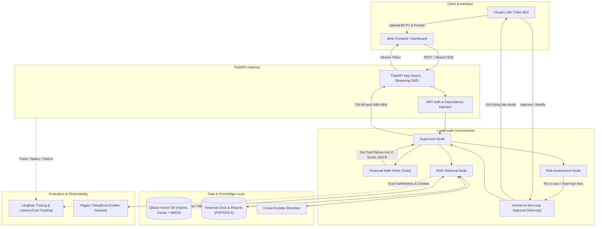

# 📑 PROJECT PROPOSAL: FinRisk AI
## Hệ thống Phân tích Báo cáo Tài chính & Thẩm định Rủi ro Tín dụng Tự động hóa
*(Enterprise Financial Intelligence & Credit Risk Copilot)*

---

## 1. TỔNG QUAN DỰ ÁN (EXECUTIVE SUMMARY)

### 1.1. Bối cảnh & Bài toán thực tế (Problem Statement)
Trong ngành Ngân hàng và Quản lý quỹ đầu tư, việc thẩm định hồ sơ tín dụng doanh nghiệp là một quy trình tốn nhiều thời gian và nguồn lực:
- **Tài liệu phức tạp, đồ sộ:** Báo cáo tài chính (BCTC) kiểm toán thường dài từ 50–200 trang dưới định dạng PDF/Scan, chứa hàng chục bảng biểu số liệu (Bảng cân đối kế toán, Báo cáo kết quả kinh doanh, Báo cáo lưu chuyển tiền tệ) cùng phần Thuyết minh BCTC dày đặc thông tin.
- **Rủi ro bỏ sót & sai lệch:** Chuyên viên tín dụng mất 2–3 ngày để đọc, đối chiếu với các quy chế cho vay, tính toán chỉ số tài chính thủ công trên Excel, dễ bỏ qua các dấu hiệu cảnh báo ngầm (suy giảm dòng tiền thuần từ HĐKD, thay đổi phương pháp khấu hao, các khoản nợ tiềm tàng ngoài bảng cân đối).
- **Thiếu tính tự động hóa và truy xuất nguồn gốc:** Các chatbot thông thường (LLM raw) dễ bị ảo giác (hallucination) khi đọc số liệu tài chính hoặc tính toán sai các phép tính toán học phức tạp.

### 1.2. Mục tiêu giải pháp (Proposed Solution)
Xây dựng hệ thống **FinRisk AI** — Trợ lý ảo AI cấp Enterprise hỗ trợ chuyên viên phân tích tài chính và thẩm định tín dụng doanh nghiệp:
1. **Trích xuất & Tìm kiếm ngữ cảnh sâu (Deep RAG):** Bóc tách tự động bảng biểu và văn bản từ PDF BCTC, lưu trữ vào Vector DB (Qdrant) với cơ chế Hybrid Search (BM25 + Dense) và Reranking.
2. **Tính toán & Phân tích chính xác (Agent & Tool Calling):** Sử dụng LLM phối hợp các Tool Python chuyên dụng để tính toán chỉ số tài chính (Altman Z-Score, DSCR, Quick Ratio, Debt-to-Equity) chính xác 100%, không để LLM tự suy diễn số học.
3. **Quy trình phê duyệt thông minh (LangGraph Multi-Agent với Human-in-the-Loop):** Xây dựng workflow StateGraph điều phối các bước thẩm định, tự động dừng lại yêu cầu chuyên viên cấp cao phê duyệt (interrupt) khi phát hiện rủi ro vượt ngưỡng hạn mức.
4. **Đo lường & Giám sát ngân hàng (Evaluation & Observability):** Đánh giá độ trung thực (Faithfulness) qua bộ metric Ragas/DeepEval và giám sát toàn bộ chi phí/latency từng request qua Langfuse.
5. **Sẵn sàng triển khai sản phẩm (Production-Ready):** Đóng gói toàn bộ hệ thống bằng Docker Compose và CI/CD tự động qua GitHub Actions.

---

## 2. KIẾN TRÚC HỆ THỐNG (SYSTEM ARCHITECTURE)

### 2.1. Sơ đồ luồng dữ liệu (Mermaid Flowchart)



### 2.2. Tech Stack Chi Tiết

| Thành phần | Công nghệ lựa chọn | Vai trò trong hệ thống |
| :--- | :--- | :--- |
| **Backend Framework** | `FastAPI`, `Uvicorn`, `Pydantic v2` | Xây dựng REST API bất đồng bộ, validate schema dữ liệu tài chính, stream token thời gian thực. |
| **LLM & Tool Calling** | `GPT-4o-mini`, `Claude 3.5 Sonnet`, `ChatGroq` | Phân tích ngữ cảnh BCTC, reasoning nhiều bước, trích xuất cấu trúc dữ liệu JSON. |
| **Vector Database** | `Qdrant` | Lưu trữ vector nhúng tài chính, hỗ trợ filter payload (mã CP, năm, quý) và hybrid search. |
| **Embeddings & Reranker** | `text-embedding-3-small`, `bge-reranker-large` | Tạo dense vector ngữ cảnh và chấm điểm độ liên quan của các điều khoản báo cáo. |
| **Agent Orchestration** | `LangGraph`, `LangChain Core (LCEL)` | Xây dựng đồ thị trạng thái (StateGraph), điều phối tool calling và Human-in-the-Loop. |
| **Evaluation** | `Ragas`, `DeepEval` | Chạy bộ kiểm thử tự động đo Faithfulness, Context Recall, Answer Relevancy. |
| **Observability** | `Langfuse` | Trace toàn bộ execution tree, ghi nhận chi phí token, latency và versioning prompt. |
| **Container & CI/CD** | `Docker`, `Docker Compose`, `GitHub Actions` | Multi-stage build đóng gói dịch vụ, tự động chạy test và build container khi commit code. |

---

## 3. LỘ TRÌNH TRIỂN KHAI CHI TIẾT (14-WEEK ROADMAP)

Lộ trình được thiết kế bám sát từng giai đoạn kỹ năng kỹ thuật, từ nền tảng backend AI đến hoàn thiện sản phẩm doanh nghiệp.

```
+---------------------------------------------------------------------------------------------------+
| TUẦN 1: Setup & Python Async -> TUẦN 2-3: FastAPI & Prompt Engineering                            |
+---------------------------------------------------------------------------------------------------+
                                                  |
+---------------------------------------------------------------------------------------------------+
| TUẦN 4-6: Deep RAG & Qdrant Hybrid Search -> TUẦN 7-9: LangGraph Agent & Human-in-the-Loop        |
+---------------------------------------------------------------------------------------------------+
                                                  |
+---------------------------------------------------------------------------------------------------+
| TUẦN 10-11: RAGAS Eval & Langfuse Observability -> TUẦN 12-13: Docker & CI/CD Pipeline           |
+---------------------------------------------------------------------------------------------------+
                                                  |
+---------------------------------------------------------------------------------------------------+
| TUẦN 14: Final Benchmark, Security Hardening & Project Portfolio Release                          |
+---------------------------------------------------------------------------------------------------+
```

---

### 🟢 Giai đoạn 0 — Tuần 1: Setup & Python nâng cao cho Backend AI
> **Mục tiêu:** Xây dựng khung kiến trúc chuẩn (Clean Architecture) cho dự án FinRisk AI, làm chủ kỹ năng lập trình bất đồng bộ (`asyncio`) để xử lý nhiều yêu cầu tra cứu và tính toán cùng lúc mà không nghẽn tài nguyên.

#### Kỹ năng & Khái niệm cốt lõi:
- **Type Hinting (`typing`):** Áp dụng triệt để `Union`, `Optional`, `TypedDict`, `Literal`, `Annotated` cho toàn bộ hàm xử lý tài chính.
- **Async/Await & Event Loop:** Hiểu sâu cơ chế Coroutine, Task, Event Loop; sử dụng `asyncio.gather()` để gọi đồng thời nhiều dịch vụ tài chính (tra cứu giá cổ phiếu + truy xuất BCTC).
- **OOP & Modular Design:** Thiết kế Abstract Base Class (`BaseFinancialRetriever`, `BaseRiskModel`).
- **Configuration & Environment:** Quản lý tập trung qua `python-dotenv` và `pydantic-settings` (tránh lộ API keys).

#### Các công việc cụ thể (Tasks):
1. Khởi tạo repository, cấu hình môi trường ảo (`venv`), thiết lập `.gitignore`, `.env.example`.
2. Viết module connector bất đồng bộ `AsyncFinancialClient` giả lập việc crawl dữ liệu tỷ giá và chỉ số thị trường.
3. Tạo benchmark so sánh hiệu năng giữa gọi đồng bộ (Sync) và bất đồng bộ (`asyncio.gather`) khi xử lý 20 hồ sơ doanh nghiệp.

#### Tài liệu tham khảo:
- [Python asyncio Documentation — Coroutines and Tasks](https://docs.python.org/3/library/asyncio-task.html)
- [Real Python — Async IO in Python: A Complete Walkthrough](https://realpython.com/async-io-python/)

---

### 🟢 Giai đoạn 1 — Tuần 2–3: FastAPI + LLM API Integration & Prompt Engineering
> **Mục tiêu:** Xây dựng hệ thống API Gateway bằng FastAPI, thiết kế các Schema Pydantic cho dữ liệu tài chính, tích hợp mô hình ngôn ngữ lớn (OpenAI/Anthropic/Groq) với kỹ thuật prompt chuyên biệt cho thẩm định tài chính.

#### Kỹ năng & Khái niệm cốt lõi:
- **FastAPI Core:** Router, Request Body, Path/Query Parameter, Dependency Injection (`Depends`) để quản lý database session & API client.
- **Streaming Response:** Sử dụng `StreamingResponse` kết hợp `Server-Sent Events (SSE)` để truyền từng token phân tích ra giao diện người dùng.
- **Pydantic Validation:** Định nghĩa cấu trúc nghiêm ngặt cho `FinancialMetric`, `CreditApplicationInput`, `RiskReportOutput`.
- **Advanced Prompting:**
  - *System vs User Prompt:* Thiết lập persona "Senior Credit Risk Analyst với 15 năm kinh nghiệm".
  - *Chain-of-Thought (CoT):* Hướng dẫn LLM từng bước suy luận: Bóc tách doanh thu $\rightarrow$ Chi phí $\rightarrow$ Biên lợi nhuận $\rightarrow$ Đánh giá nợ $\rightarrow$ Kết luận.
  - *Few-shot Prompting:* Cung cấp 2–3 mẫu phân tích báo cáo tài chính chuẩn để chuẩn hóa văn phong và định dạng kết quả.
  - *Structured Output (JSON Mode):* Ép LLM luôn trả về JSON hợp lệ theo Pydantic schema.
  - *Prompt Caching:* Tận dụng cơ chế cache prompt của Anthropic/OpenAI cho các tài liệu chính sách tín dụng dùng chung để giảm chi phí API đến 80%.

#### Các công việc cụ thể (Tasks):
1. Xây dựng các endpoints:
   - `POST /api/v1/analyze/summary`: Phân tích nhanh chỉ số tài chính cơ bản.
   - `POST /api/v1/analyze/stream`: Stream văn bản giải trình rủi ro ra giao diện.
   - `POST /api/v1/extract/structured`: Ép kiểu dữ liệu báo cáo sang JSON schema chuẩn.
2. Tích hợp Swagger UI (`/docs`) với tài liệu mô tả đầy đủ tham số và mã lỗi HTTP (400, 422, 500).

#### Tài liệu tham khảo:
- [FastAPI Official Tutorial](https://fastapi.tiangolo.com/tutorial/)
- [freeCodeCamp — FastAPI Tutorial for Beginners](https://www.youtube.com/watch?v=VirndPTeRaw)
- [Anthropic Prompt Engineering Interactive Tutorial & Courses](https://github.com/anthropics/courses)
- [Anthropic — Prompt Engineering Best Practices](https://docs.anthropic.com/en/docs/build-with-claude/prompt-engineering/overview)

---

### 🟢 Giai đoạn 2 — Tuần 4–6: RAG Chuyên sâu cho Dữ liệu Tài chính (Deep RAG)
> **Mục tiêu:** Giải quyết bài toán tìm kiếm chính xác thông tin trên các tài liệu tài chính phức tạp (PDF bảng biểu, thông tư tín dụng) bằng kỹ thuật Hybrid Search và Reranking trong Qdrant.

#### Kỹ năng & Khái niệm cốt lõi:
- **Document Parsing:** Xử lý file PDF/DOCX BCTC bằng `pdfplumber` / `pypdf`, bảo toàn cấu trúc bảng biểu tài chính (chuyển đổi bảng thành Markdown/HTML trước khi chunking).
- **Chunking Strategies:** 
  - So sánh *Fixed-size chunking* vs *Recursive Character Splitting* vs *Semantic Chunking*.
  - Áp dụng kỹ thuật chunking theo từng phần (Section-based chunking) để không cắt ngang một bảng số liệu tài chính; thiết lập `chunk_overlap=15%` để giữ ngữ cảnh.
- **Vector Database (Qdrant):**
  - Khởi tạo Qdrant container, tạo collection `financial_reports`.
  - Cấu hình HNSW index tối ưu tốc độ tra cứu, thiết lập Payload Indexing theo: `ticker` (mã cổ phiếu), `fiscal_year` (năm), `quarter` (quý), `doc_type` (BCTC/Thuyết minh/Thông tư).
- **Hybrid Search & Reranking:**
  - Kết hợp *Dense Vector* (nắm bắt ngữ cảnh ngữ nghĩa) + *Sparse Vector (BM25)* để tìm kiếm chính xác các mã tài khoản kế toán, số hiệu nghị định/thông tư ngân hàng.
  - Sử dụng mô hình Cross-Encoder Reranker (`bge-reranker-large` hoặc Cohere Rerank) chấm điểm lại Top 20 kết quả để chọn ra Top 5 chunk quan trọng nhất nạp vào LLM context window.

#### Các công việc cụ thể (Tasks):
1. Viết pipeline bóc tách tự động một bộ BCTC PDF mẫu (ví dụ: Vinamilk VNM hoặc Hòa Phát HPG).
2. Thiết lập Qdrant collection với payload schema tối ưu.
3. Viết module `FinancialHybridRetriever` kết hợp Qdrant Search + BM25 + Reranker.
4. Xây dựng endpoint `POST /api/v1/documents/upload` và `POST /api/v1/rag/query`.

#### Tài liệu tham khảo:
- [Pinecone — Chunking Strategies for LLM Applications](https://www.pinecone.io/learn/chunking-strategies/)
- [Qdrant — Quickstart & Overview Documentation](https://qdrant.tech/documentation/quickstart/)
- [DeepLearning.AI — Advanced Retrieval for AI with Chroma & LangChain](https://www.deeplearning.ai/courses/)

---

### 🟢 Giai đoạn 3 — Tuần 7–9: LangChain, Function Calling & LangGraph Multi-Agent với Human-in-the-Loop
> **Mục tiêu:** Xây dựng hệ thống Agent có khả năng suy luận đa bước (multi-step reasoning), tự động gọi các tool tính toán tài chính chuẩn xác và có chốt chặn Human-in-the-Loop để người có thẩm quyền phê duyệt hạn mức tín dụng.

#### Kỹ năng & Khái niệm cốt lõi:
- **LCEL (LangChain Expression Language):** Xây dựng các pipeline nhỏ gọn sử dụng toán tử pipe `|` (`prompt | llm | parser`).
- **Function / Tool Calling:**
  - Định nghĩa Python Tools với `@tool` và JSON Schema chặt chẽ.
  - Tool 1: `calculate_altman_z_score(working_capital, total_assets, retained_earnings, ebit, market_val, total_liab, sales)` — Đánh giá nguy cơ phá sản của doanh nghiệp.
  - Tool 2: `calculate_dscr(net_operating_income, total_debt_service)` — Khả năng trả nợ gốc và lãi.
  - Tool 3: `check_credit_bureau_cic(tax_id)` — Giả lập tra cứu lịch sử nợ xấu tại CIC.
- **LangGraph StateGraph:**
  - Thiết kế State: `CreditAuditState` lưu trữ messages, extracted_metrics, calculated_ratios, risk_tier, audit_status.
  - Node 1: `extract_financials` (gọi RAG lấy số liệu từ BCTC).
  - Node 2: `compute_ratios` (Agent tự động gọi các Tool tính toán toán học).
  - Node 3: `evaluate_policy` (đối chiếu tỷ lệ nợ với quy chế tín dụng ngân hàng).
  - Node 4: `human_approval_node` (Human-in-the-Loop: Tạm dừng đồ thị bằng `interrupt()`, chờ chuyên viên kiểm tra và gửi tín hiệu chấp thuận/từ chối).
  - Node 5: `generate_final_memo` (sinh biên bản thẩm định chính thức).

#### Các công việc cụ thể (Tasks):
1. Xây dựng các Tools tính toán tài chính độc lập có kèm unit test kiểm tra công thức.
2. Xây dựng đồ thị `StateGraph` hoàn chỉnh trong LangGraph có tích hợp cơ chế Checkpointer (`MemorySaver` hoặc `SqliteSaver`) để lưu trạng thái phiên thẩm định.
3. Triển khai API cho phép chuyên viên tín dụng xem các cảnh báo rủi ro và bấm "Duyệt" (Resume Graph) hoặc "Yêu cầu giải trình thêm".

#### Tài liệu tham khảo:
- [DeepLearning.AI — LangChain for LLM Application Development](https://www.deeplearning.ai/courses/langchain)
- [Anthropic — Tool Use / Function Calling Guide](https://platform.claude.com/docs/en/agents-and-tools/tool-use/overview)
- [DeepLearning.AI — AI Agents in LangGraph](https://www.deeplearning.ai/courses/ai-agents-in-langgraph)
- [DeepLearning.AI — Long-Term Agentic Memory with LangGraph](https://www.deeplearning.ai/courses/long-term-agentic-memory-with-langgraph)

---

### 🟢 Giai đoạn 4 — Tuần 10–11: Evaluation & Observability chuẩn Ngân hàng
> **Mục tiêu:** Đo lường định lượng chất lượng của hệ thống RAG/Agent để ngăn ngừa ảo giác số liệu và giám sát chi phí vận hành, độ trễ trên môi trường thực tế.

#### Kỹ năng & Khái niệm cốt lõi:
- **RAG Evaluation Metrics (Ragas & DeepEval):**
  - *Faithfulness (Độ trung thực):* Câu trả lời có đúng 100% với tài liệu BCTC không? (Bắt buộc $\ge 0.95$ trong bài toán tài chính).
  - *Answer Relevancy (Độ liên quan):* Câu trả lời có giải quyết đúng thắc mắc của chuyên viên tín dụng không?
  - *Context Precision (Độ chính xác ngữ cảnh):* Top chunk retrieved có chứa số liệu cần thiết không?
  - *Context Recall (Độ bao phủ ngữ cảnh):* RAG có lấy đủ thông tin để trả lời câu hỏi phức tạp không?
- **Golden Dataset:** Xây dựng tập dữ liệu kiểm chuẩn gồm 50 ca thẩm định thực tế (câu hỏi, ngữ cảnh BCTC đính kèm, câu trả lời chuẩn - ground truth từ chuyên gia).
- **LLM-as-a-Judge & G-Eval:** Tự động hóa việc chấm điểm đầu ra của Agent qua các tiêu chí tuân thủ pháp lý.
- **Enterprise Observability với Langfuse:**
  - Tích hợp decorator `@observe()` và callback handler vào FastAPI & LangGraph.
  - Giám sát toàn diện: Traces (toàn bộ phiên xử lý), Spans (từng bước RAG/Tool), Generations (từng prompt/response của LLM).
  - Phân tích chi phí (Token Cost Tracking) và đo độ trễ (Latency P50, P95, P99).
  - Prompt Management & Versioning: Quản lý phiên bản prompt trực tiếp trên Langfuse mà không cần redeploy code.

#### Các công việc cụ thể (Tasks):
1. Viết script đánh giá tự động bằng Ragas `evaluate(dataset, metrics=[faithfulness, answer_relevancy, context_precision, context_recall])`.
2. Cài đặt self-hosted Langfuse hoặc tích hợp Langfuse Cloud, kết nối toàn bộ hệ thống API.
3. Xuất báo cáo benchmark chất lượng trước và sau khi có Reranker & Tool Calling.

#### Tài liệu tham khảo:
- [Ragas — Official Documentation & Quickstart](https://docs.ragas.io/en/stable/getstarted/)
- [DeepEval — Unit Testing for LLM Applications & RAG](https://deepeval.com/docs/getting-started-rag)
- [Langfuse — Tracing & Observability for LangChain/LangGraph](https://langfuse.com/docs/observability/get-started)

---

### 🟢 Giai đoạn 5 — Tuần 12–13: Đóng gói Docker & CI/CD Pipeline
> **Mục tiêu:** Container hóa toàn bộ hệ thống để có thể deploy một lệnh trên bất kỳ máy chủ nào, đồng thời thiết lập quy trình tự động hóa kiểm thử và đóng gói khi đẩy code lên Git.

#### Kỹ năng & Khái niệm cốt lõi:
- **Dockerfile Best Practices:**
  - Multi-stage build (tách riêng build stage để cài dependencies và runtime stage với image `python:3.11-slim` siêu nhẹ, giảm kích thước từ ~1.5GB xuống < 220MB).
  - Chạy bằng Non-root user để tăng cường an toàn thông tin (chuẩn bảo mật ngân hàng).
- **Docker Compose:**
  - Định nghĩa file `docker-compose.yml` gồm các services liên kết trong cùng Docker Network:
    - `finrisk-api`: Ứng dụng chính (FastAPI + LangGraph).
    - `qdrant-db`: Vector Database lưu trữ báo cáo tài chính.
    - `redis`: Caching kết quả tra cứu và quản lý rate limit.
    - `langfuse-server` + `postgres`: Hệ thống Observability nội bộ.
  - Quản lý persistent storage qua Docker Volumes để bảo toàn dữ liệu vector và logs.
- **GitHub Actions (CI/CD Pipeline):**
  - Workflow `.github/workflows/ci.yml`:
    - Trigger khi có `push` hoặc `pull_request` vào nhánh `main`.
    - Step 1: Checkout repository & thiết lập Python với cache pip.
    - Step 2: Chạy linter & code format check (`flake8`, `black`).
    - Step 3: Chạy Unit Test (`pytest`) cho các tool tài chính và Pydantic schema.
    - Step 4: Chạy Integration Test giả lập gọi API FastAPI.
    - Step 5: Build Docker Image và kiểm tra lỗ hổng bảo mật cơ bản.

#### Các công việc cụ thể (Tasks):
1. Hoàn thiện `Dockerfile` và file `.dockerignore` tối ưu.
2. Viết file `docker-compose.yml` chạy kiểm thử mượt mà môi trường local.
3. Tạo workflow file trên GitHub Actions, kiểm tra pipeline xanh 100% khi merge code.

#### Tài liệu tham khảo:
- [freeCodeCamp — Docker Full Course](https://www.freecodecamp.org/news/docker-full-course/)
- [Docker — Compose Quickstart Guide](https://docs.docker.com/compose/gettingstarted/)
- [GitHub Docs — Building and Testing Python with GitHub Actions](https://docs.github.com/actions/guides/building-and-testing-python)
- [Docker Docs — Automate your builds with GitHub Actions](https://docs.docker.com/guides/python/configure-github-actions/)

---

### 🟢 Giai đoạn 6 — Tuần 14: Demo, Benchmark Toàn diện & Portfolio Showcase
> **Mục tiêu:** Hoàn thiện sản phẩm, chạy bài kiểm tra hiệu năng tổng thể và chuẩn bị tài liệu dự án chuyên nghiệp.

#### Deliverables bàn giao:
1. **Source Code hoàn chỉnh:** Repository có cấu trúc module rõ ràng, chuẩn type hint, test coverage $> 80\%$.
2. **Interactive Swagger Documentation:** Đầy đủ mô tả các endpoints tại `/docs`.
3. **Báo cáo Benchmark Ragas:** Bảng so sánh chỉ số Faithfulness, Latency trước và sau khi tối ưu.
4. **Langfuse Dashboard Demo:** Minh họa trực quan đường đi của một ca thẩm định rủi ro phức tạp.
5. **Video Demo / Screencast:** Luồng chuyên viên upload BCTC $\rightarrow$ Agent phân tích $\rightarrow$ Cảnh báo rủi ro $\rightarrow$ Duyệt Human-in-the-Loop $\rightarrow$ Xuất biên bản thẩm định.

---

## 4. TIÊU CHÍ ĐO LƯỜNG THÀNH CÔNG (KEY METRICS & KPIS)

| Hạng mục | Chỉ số KPI mục tiêu | Phương pháp đo lường |
| :--- | :--- | :--- |
| **Độ trung thực (Faithfulness)** | $\ge 95\%$ | Đánh giá bằng Ragas trên Golden Dataset gồm 50 BCTC. |
| **Độ chính xác tính toán** | $100\%$ | Toàn bộ phép tính tài chính (DSCR, Z-Score) thực thi qua Python Tools, có unit test kiểm chuẩn. |
| **Độ trễ phản hồi (Streaming)** | First Token $< 1.2\text{s}$ | Đo qua Langfuse Latency Dashboard trên kết nối mạng tiêu chuẩn. |
| **Bảo mật & Phê duyệt** | $100\%$ các case rủi ro cao phải qua Human-in-the-Loop | Cơ chế `interrupt()` của LangGraph bắt buộc chuyên viên ký duyệt. |
| **Test Coverage Backend** | $\ge 80\%$ | Báo cáo `pytest-cov` chạy tự động trên GitHub Actions. |
| **Kích thước Docker Image** | $< 250\text{MB}$ | Kiểm tra image size sau khi chạy multi-stage build. |

---

## 5. CẤU TRÚC THƯ MỤC DỰ ÁN DỰ KIẾN (PROJECT DIRECTORY TREE)

```bash
finrisk-ai/
├── .github/
│   └── workflows/
│       └── ci.yml                     # Pipeline tự động test và build docker
├── src/
│   ├── api/
│   │   ├── dependencies.py            # Dependency injection (Auth, DB, LLM)
│   │   ├── routers/
│   │   │   ├── audit.py               # Endpoints thẩm định tín dụng
│   │   │   ├── documents.py           # Endpoints upload & index BCTC
│   │   │   └── health.py              # Health check endpoint
│   │   └── main.py                    # Khởi tạo FastAPI app & middleware
│   ├── core/
│   │   ├── config.py                  # Pydantic BaseSettings quản lý .env
│   │   └── logging.py                 # Structured JSON logging
│   ├── agent/
│   │   ├── graph.py                   # StateGraph LangGraph (nodes, edges, interrupts)
│   │   ├── state.py                   # CreditAuditState TypedDict
│   │   ├── nodes/                     # Các node xử lý: retrieve, calculate, audit
│   │   └── tools/                     # Python Tools: z_score, dscr, cic_check
│   ├── rag/
│   │   ├── parser.py                  # Trích xuất PDF và bảng biểu BCTC
│   │   ├── chunking.py                # Semantic & recursive splitter
│   │   ├── vectorstore.py             # Qdrant client & collection management
│   │   └── retriever.py               # Hybrid Search (Dense + BM25) + Reranker
│   └── eval/
│       ├── golden_dataset.json        # 50 ca kiểm chuẩn thực tế
│       └── run_eval.py                # Script chạy Ragas & DeepEval
├── tests/
│   ├── unit/                          # Unit tests cho tools và schema
│   └── integration/                   # Integration tests cho API
├── docker-compose.yml                 # Orchestration cho App, Qdrant, Redis, Langfuse
├── Dockerfile                         # Multi-stage build tối ưu cho production
├── requirements.txt                   # Dependencies
├── .env.example                       # Mẫu cấu hình môi trường
└── README.md                          # Hướng dẫn cài đặt và vận hành
```

---

> 📌 **Bản proposal này sẵn sàng để:**
> 1. Trình bày với Tech Lead / Quản lý dự án để xin phê duyệt triển khai.
> 2. Đưa vào Portfolio / CV dưới dạng một dự án Enterprise-grade hoàn chỉnh chứng minh toàn diện các kỹ năng từ Backend, GenAI, Agent đến MLOps/DevOps.
