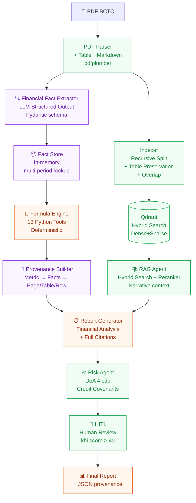

# 🏦 PROJECT PROPOSAL: FinRisk AI — v4.0 (Plan B)
## Tự động Phân tích BCTC & Tính Financial Ratios với Provenance
### *(Evidence-Aware Financial Statement Analysis — Solo-buildable Capstone)*

---

## 1. MỤC TIÊU ĐỒ ÁN

Đây là dự án capstone tổng hợp kiến thức từ **Phase 1 đến Phase 4**, với phạm vi được thu hẹp thành **một lát cắt dọc hoàn chỉnh** — đủ chiều sâu kỹ thuật để viết thesis/capstone, vừa sức thực hiện một mình trong 8–10 tuần.

### 1.1. Tại sao chuyển từ FinRisk AI v3?

FinRisk AI v3 (48 sections, 8+ agents, cross-document verification, Credit Memo...) là kiến trúc của một **startup product** cần team 5–10 người và 6–12 tháng. Một cá nhân cố build toàn bộ sẽ bị phân tán và không hoàn thành được phần nào chắc chắn.

**Plan B** giữ **nguyên vẹn toàn bộ code đã build** (Phase 1–3), và thêm 3 layer mới tập trung vào đúng vấn đề kỹ thuật có chiều sâu nhất:

> **"Trích xuất Financial Facts từ BCTC, tính Financial Ratios deterministic, và truy nguyên mọi kết quả về trang/bảng/dòng trong PDF gốc."**

### 1.2. Technical Contributions rõ ràng

| Contribution | Nội dung |
|---|---|
| **C1 — Structured Financial Fact Extraction** | LLM structured output (Pydantic) trích xuất fact có provenance (page, table, row) thay vì plain text RAG |
| **C2 — Deterministic Financial Reasoning** | Python Formula Engine tính 13 ratios, LLM không được tự tính — tránh hallucination số liệu |
| **C3 — End-to-end Provenance Chain** | Mỗi ratio truy nguyên được: Metric → Inputs → FinancialFacts → Page/Table/Row trong PDF |
| **C4 — Evidence-Aware RAG vs Token RAG** | Ablation study so sánh: Fixed Chunk / Recursive / Table-preserving / Parent-Child / Evidence-Aware |

---

## 2. BÀI TOÁN CỤ THỂ

### 2.1. Input
- 1–2 file PDF BCTC kiểm toán (Balance Sheet, Income Statement, Cash Flow Statement, Notes)
- Thông tin hồ sơ vay (số tiền, kỳ hạn, lãi suất, loại TSBĐ, giá trị TSBĐ) — nhập tay hoặc trích từ PDF

### 2.2. Pipeline

```
PDF BCTC
    ↓
[1] PDF Parser (pdfplumber + Markdown Table)          ← ĐÃ BUILD
    ↓
[2] Financial Fact Extractor (LLM structured output)  ← MỚI
    → Trích xuất: {concept, value, period, page, table_id, row_label, confidence}
    ↓
[3] Fact Store (in-memory, multi-period)              ← MỚI
    ↓
[4] Deterministic Formula Engine (13 Python tools)    ← ĐÃ BUILD + MỞ RỘNG
    → Tính: Altman Z, DSCR, Pro-forma DSCR, D/E, Quick Ratio,
            Current Ratio, Gross Margin, EBITDA Margin, ROA, ROE,
            Interest Coverage, LTV, Working Capital
    ↓
[5] Provenance Builder                                ← MỚI
    → Metric → Inputs → FinancialFacts → Source (Page/Table/Row)
    ↓
[6] RAG Agent (Hybrid Search narrative context)       ← ĐÃ BUILD
    ↓
[7] Report Generator (report với citations đầy đủ)    ← NÂNG CẤP
```

### 2.3. Output

```
FINANCIAL ANALYSIS REPORT
━━━━━━━━━━━━━━━━━━━━━━━━━━━━━━━━━━━━━━━━━

[1] EXTRACTED FINANCIAL FACTS (17 concepts)
  ├── total_assets: 10,000B [Trang 5, Bảng 1, Dòng "Tổng tài sản", confidence=0.97]
  ├── revenue:       3,200B [Trang 8, Bảng 2, Dòng "Doanh thu thuần", confidence=0.99]
  └── ...

[2] FINANCIAL RATIOS (13 metrics) — mỗi ratio có provenance
  ├── Altman Z-Score: 2.84 (GREY zone)
  │   └── Inputs: working_capital[p5,T1], retained_earnings[p5,T1], ebit[p8,T2], ...
  ├── DSCR (lịch sử): 1.32 → ADEQUATE
  ├── Pro-forma DSCR: 1.08 → MARGINAL
  └── ...

[3] RISK ASSESSMENT — DoA Recommendation
  ├── Risk Score: 38/100 → FAST_TRACK_REVIEW
  └── Credit Covenants: [...]

[4] NARRATIVE CONTEXT (từ RAG)
  └── Thuyết minh BCTC page 15: "..."  [Citation: page 15]

[5] DATA GAPS (facts không tìm được)
  └── market_cap: NOT_FOUND (dùng book value fallback)
```

---

## 3. KIẾN TRÚC HỆ THỐNG



---

## 4. TECH STACK

| Tầng | Công nghệ | Ghi chú |
|:---|:---|:---|
| **LLM** | Groq `openai/gpt-oss-120b` (dev) → Claude Haiku (prod) | Structured output cho Fact Extraction |
| **Multi-Agent** | `LangGraph` StateGraph | Đã có — giữ nguyên |
| **Fact Extraction** | Pydantic structured output | LLM trả về typed schema, không free-text |
| **Formula Engine** | Python thuần | 13 tools deterministic — LLM không tính số |
| **Vector DB** | `Qdrant` Hybrid Search | Dense (BGE-M3) + Sparse (BM25) + RRF |
| **Embedding** | `BAAI/bge-m3` | Đã có |
| **Reranker** | `BAAI/bge-reranker-v2-m3` | Đã có |
| **PDF Parsing** | `pdfplumber` | Đã có — table → Markdown |
| **Web Intelligence** | `Tavily Search API` | 5C Character fallback mode |
| **Evaluation** | `Ragas` + custom metrics | Extraction F1, Numeric Accuracy, Provenance Accuracy |
| **Observability** | `Langfuse` | Traces + cost tracking (Phase tùy chọn) |
| **Config** | `pydantic-settings` | Singleton `get_settings()` |

---

## 5. LỘ TRÌNH 10 TUẦN

---

### 🔵 GIAI ĐOẠN 1 — Tuần 1 (ĐÃ HOÀN TẤT)
**LangGraph Multi-Agent Core**

✅ StateGraph, Supervisor routing, Tool Calling, HITL interrupt  
✅ 4 financial tools: Z-Score, DSCR, D/E, Quick Ratio  
✅ 12/12 unit tests PASS

---

### 🟢 GIAI ĐOẠN 2 — Tuần 2–3 (ĐÃ HOÀN TẤT)
**Deep RAG Engine**

✅ PDF Parser + Markdown Table conversion  
✅ Recursive Separator Splitter + Table Preservation + 30-token Overlap  
✅ Qdrant Hybrid Search (Dense BGE-M3 + Sparse BM25 + RRF)  
✅ BGE Reranker + Parent Deduplication  
✅ 10/10 retriever tests PASS

---

### 🟡 GIAI ĐOẠN 3 — Tuần 4 (ĐÃ HOÀN TẤT)
**Banking-Grade Logic & DoA Model**

✅ Pro-forma DSCR (PMT formula chuẩn tài chính)  
✅ LTV với 4 loại TSBĐ + ngưỡng Basel II  
✅ DoA 4 cấp (FAST_TRACK / STANDARD_AUDIT / CREDIT_COMMITTEE / DECLINE)  
✅ Credit Covenants tự động  
✅ Tavily External News Search + fallback  
✅ 45 test cases PASS → Tổng **57/57 PASS**

---

### 🟠 GIAI ĐOẠN 4 — Tuần 5–6 *(MỚI — ĐANG THỰC HIỆN)*
**Financial Fact Extractor + Fact Store + Provenance**

#### Mục tiêu
Xây dựng layer trích xuất structured financial facts từ PDF BCTC — đây là **core contribution** kỹ thuật của Plan B.

#### Kỹ năng cốt lõi
- **LLM Structured Output**: Dùng Pydantic schema để LLM trả về `list[FinancialFact]` thay vì free-text
- **Financial Ontology**: Map alias tiếng Việt → canonical concept (`"Doanh thu thuần"` → `REVENUE`)
- **Provenance Model**: Mỗi fact có `page`, `table_id`, `row_label`, `confidence`
- **Multi-period Fact Store**: Lookup theo `(concept, period)` key — hỗ trợ so sánh 3 năm

#### Deliverables
- `src/extractor/fact_extractor.py` — LLM extraction với Pydantic
- `src/extractor/fact_store.py` — in-memory store + lookup
- `src/extractor/provenance.py` — build trace chain
- `FinancialFact` + `ProvTrace` TypedDict vào `state.py`
- `tests/test_extractor.py` — unit tests không cần LLM (mock)

---

### 🔴 GIAI ĐOẠN 5 — Tuần 7 *(MỚI)*
**Mở rộng Financial Formula Engine**

#### Mục tiêu
Nâng từ 7 lên 13 financial tools — auto-populate từ Fact Store thay vì nhập tay.

#### Tools mới thêm (6)
| Tool | Formula | 5C |
|------|---------|-----|
| `calculate_current_ratio` | Current Assets / Current Liabilities | Capital |
| `calculate_gross_margin` | Gross Profit / Revenue | Capacity |
| `calculate_ebitda_margin` | EBITDA / Revenue | Capacity |
| `calculate_roa` | Net Income / Total Assets | Capacity |
| `calculate_roe` | Net Income / Total Equity | Capital |
| `calculate_interest_coverage` | EBIT / Interest Expense | Capacity |

#### Nâng cấp Math Agent
- Auto-populate facts từ `state.financial_facts` → không cần user nhập `raw_financials` tay
- Ghi `provenance_traces` vào state sau mỗi tool call

---

### 🟣 GIAI ĐOẠN 6 — Tuần 8 *(MỚI)*
**Report Generator với Citations + Demo Script**

#### Mục tiêu
Report cuối có truy xuất nguồn đầy đủ — mỗi assertion quan trọng đều có citation.

#### Kỹ năng cốt lõi
- **Citation-aware report**: `report_node` nâng cấp gắn `[Trang X, Bảng Y, Dòng Z]` vào mỗi metric
- **Data Gaps section**: Liệt kê các fact không tìm được → chuyên viên biết cần bổ sung
- **CLI Demo Script**: `python scripts/analyze_bctc.py --pdf bctc.pdf --company "Vinamilk" --year 2024`

---

### ⚪ GIAI ĐOẠN 7 — Tuần 9–10 *(Research & Evaluation)*
**Evaluation Suite + Ablation Study**

#### Evaluation Metrics

| Layer | Metric |
|-------|--------|
| Fact Extraction | Concept Accuracy, Value Accuracy, Period Accuracy |
| Provenance | Citation Accuracy (page/table/row đúng không?) |
| Retrieval | Recall@K, MRR, nDCG |
| Numerical | Numeric Accuracy (ratio tính đúng không?) |
| Generation | Faithfulness, Hallucination Rate |

#### Ablation Study (Research Contribution)

```
S1: Fixed-size Chunking + LLM tự tính ratio
S2: Recursive Chunking + LLM tự tính ratio
S3: Table-preserving + LLM tự tính ratio
S4: Parent-Child RAG + LLM tự tính ratio
S5: Evidence-Aware RAG + Deterministic Formula Engine  ← Proposed
```

Mục tiêu chứng minh: **S5 > S1-S4** về numeric accuracy và provenance coverage.

#### Golden Dataset
Tự xây bộ testset 30–50 câu hỏi tài chính với ground truth:
```json
{
  "question": "Current ratio năm 2024 là bao nhiêu?",
  "required_facts": ["current_assets_2024", "current_liabilities_2024"],
  "gold_evidence": "BCTC_2024:p5:Bảng_CĐKT:Tổng_tài_sản_ngắn_hạn",
  "formula": "current_assets / current_liabilities",
  "gold_answer": 1.24
}
```

---

## 6. PHẠM VI & CAM KẾT

| Hạng mục | Trong scope | Ngoài scope (Phase sau) |
|----------|------------|------------------------|
| PDF parsing + fact extraction | ✅ | |
| 13 financial ratios | ✅ | |
| Provenance chain đầy đủ | ✅ | |
| RAG narrative context | ✅ | |
| Multi-period (2–3 năm) | ✅ | |
| CLI report + JSON output | ✅ | |
| Ablation study | ✅ | |
| FastAPI + UI | | ❌ Phase C |
| Cross-document consistency | | ❌ Phase C |
| PostgreSQL persistent store | | ❌ Phase C (in-memory) |
| Multi-company comparison | | ❌ Phase C |
| CI/CD + VPS deploy | | ❌ Phase C |

---

## 7. TIÊU CHÍ HOÀN THÀNH (DEFINITION OF DONE)

### Functional
- [ ] Upload PDF → Extract ≥ 15 financial facts với page/table/row provenance
- [ ] Tính đủ 13 financial ratios từ extracted facts (không nhập tay)
- [ ] Mỗi ratio có `provenance_trace` đầy đủ
- [ ] Report section "Data Gaps" — biết fact nào không tìm được
- [ ] Multi-period: so sánh được 2 năm BCTC
- [ ] `python scripts/analyze_bctc.py --demo` chạy end-to-end thành công

### Research
- [ ] Golden dataset ≥ 30 câu
- [ ] Ablation study S1–S5 hoàn chỉnh
- [ ] Extraction F1 ≥ 0.80 trên test set
- [ ] Numeric Accuracy ≥ 0.95 (deterministic engine)
- [ ] Provenance Accuracy ≥ 0.85 (page citation đúng)

### Tests
- [ ] `pytest tests/ -v -m "not integration"` → tất cả PASS
- [ ] `pytest tests/ -v` (full, cần Qdrant Docker) → tất cả PASS

---

## 8. CÁC FILE CHEATSHEET HỖ TRỢ

| File | Nội dung | Khi nào đọc |
|:---|:---|:---|
| [`rag_pipeline_cheatsheet.md`](./rag_pipeline_cheatsheet.md) | Dense/Sparse, RRF, Cross-Encoder, Parent-Doc | Thiết kế RAG pipeline |
| [`retriever_strategies_cheatsheet.md`](../phase_4/retriever_strategies_cheatsheet.md) | 14 chiến thuật Retriever hiện đại | Khi muốn nâng cấp retrieval |
| [`business_domain_guide.md`](./business_domain_guide.md) | Nghiệp vụ 5C, DSCR, Altman Z | Hiểu domain tài chính |
| [`production_devops_cheatsheet.md`](./production_devops_cheatsheet.md) | Nginx, SSL, CI/CD, Docker | Phase C — Production |
| [`langfuse_observability_cheatsheet.md`](../phase_4/langfuse_observability_cheatsheet.md) | Langfuse tích hợp | Phase tùy chọn |
