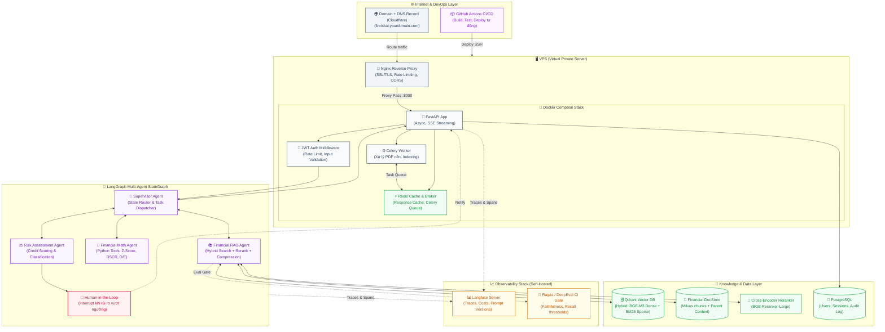

# 🏦 PROJECT PROPOSAL: FinRisk AI — v2.0
## Hệ thống Phân tích Báo cáo Tài chính & Thẩm định Rủi ro Tín dụng Tự động hóa
### *(Enterprise Financial Intelligence Copilot — Production-Grade)*

---

## 1. MỤC TIÊU ĐỒ ÁN (LEARNING OBJECTIVES)

Đây là dự án capstone tổng hợp **toàn bộ kiến thức từ Phase 1 đến Phase 4** và bổ sung thêm một **Phase 5 mới: Production Engineering & CI/CD** — kỹ năng tách biệt người làm AI research với người xây AI product thực sự.

Sau khi hoàn thành dự án, bạn sẽ tự tin vào phỏng vấn và tuyên bố:
> *"Tôi đã tự tay xây dựng, đánh giá, deploy và vận hành một hệ thống Multi-Agent RAG cấp doanh nghiệp trên VPS thực tế, bao gồm CI/CD pipeline, observability, cost tracking và rollback strategy."*

---

## 2. BỨC TRANH HỆ THỐNG TOÀN CẢNH

### 2.1. Bài toán thực tế
Chuyên viên thẩm định tín dụng mất **2–3 ngày làm thủ công** để:
* Đọc 50–200 trang BCTC kiểm toán dạng PDF.
* Tra cứu thủ công Thông tư 41 / Quyết định 493 của NHNN Việt Nam.
* Tính tay trên Excel các chỉ số: **Altman Z-Score, DSCR, Debt-to-Equity, Quick Ratio**.
* Viết báo cáo thẩm định từ đầu theo mẫu đồng nhất.

**FinRisk AI** rút ngắn quy trình này xuống **dưới 5 phút** với độ chính xác số liệu 100% và truy xuất nguồn gốc (Citations) đầy đủ.

### 2.2. Sơ đồ Kiến trúc Tổng thể

---

## 3. TECH STACK ĐẦY ĐỦ

| Tầng | Công nghệ | Lý do chọn |
| :--- | :--- | :--- |
| **API Backend** | `FastAPI` + `Uvicorn` + `Pydantic v2` | Async native, validation tự động, SSE streaming |
| **Multi-Agent** | `LangGraph` StateGraph | Vòng lặp, HITL interrupt, State persistence |
| **LLM** | `Claude 3.5 Haiku` (chính) + `GPT-4o-mini` (fallback) | Nhanh, rẻ, hỗ trợ Prompt Caching |
| **Vector DB** | `Qdrant` (Self-hosted Docker) | Hybrid Search native, filter payload theo mã CP/năm |
| **Embedding** | `BAAI/bge-m3` + `BM25` sparse | Đa ngữ, chuẩn cho tài liệu tiếng Việt |
| **Reranker** | `BAAI/bge-reranker-v2-m3` | Chấm điểm lại cross-attention, tăng Precision |
| **Prompt Management** | `Langfuse` Prompt Registry | Sửa prompt không cần deploy lại code |
| **Observability** | `Langfuse` (Self-hosted v3) | Traces, Cost, Token tracking, A/B Prompt testing |
| **Evaluation** | `Ragas` + `DeepEval` | CI/CD Quality Gate — chặn deploy nếu Faithfulness < 0.85 |
| **Cache** | `Redis` | Response cache (giảm trùng gọi API), Celery broker |
| **Background Jobs** | `Celery` | Index PDF mới nền, không block request |
| **Database** | `PostgreSQL` | Users, Sessions, Audit trail, Prompt versions |
| **Reverse Proxy** | `Nginx` | SSL Termination, Rate Limiting, CORS, Load Balance |
| **Container** | `Docker Compose` v2 | Orchestration nhẹ, phù hợp 1 VPS |
| **CI/CD** | `GitHub Actions` | Auto test → lint → build → deploy SSH on push |
| **Hạ tầng** | `VPS` Ubuntu 22.04 (4vCPU, 8GB RAM) | Full control, on-premise data, giá rẻ |

---

## 4. LỘ TRÌNH HỌC & XÂY DỰNG (12 TUẦN)

---

### 🔵 GIAI ĐOẠN 1 — Tuần 1–2: LangGraph Multi-Agent Core
> **Mục tiêu:** Làm chủ LangGraph StateGraph để điều phối Multi-Agent, Tool Calling và HITL.

#### Kỹ năng cốt lõi:
- **LangGraph State Machine:** TypedDict State, Nodes (hàm Python thuần), Normal Edges vs Conditional Edges
- **Multi-Agent Routing:** Supervisor pattern — LLM đọc State và quyết định dispatch cho Agent nào
- **Tool Calling an toàn:** Validate đầu vào tool (Pydantic), try/except trả về lỗi có cấu trúc, chống OOM với input size limit
- **Human-in-the-Loop:** `interrupt_before`, `interrupt_after`, khôi phục từ Checkpointer khi con người phê duyệt xong

#### Bài tập thực hành:
1. Viết StateGraph cho pipeline: `Supervisor → RAGNode → MathNode → RiskNode → HITL → Output`
2. Giả lập tool `calculate_zscore(working_capital, total_assets, ...)` trả về Altman Z-Score
3. Thêm HITL interrupt khi Z-Score < 1.8 (ngưỡng phá sản cao)
4. Viết Checkpointer dùng SQLite để duy trì State qua các phiên

---

### 🟢 GIAI ĐOẠN 2 — Tuần 3–4: Deep RAG cho Tài chính
> **Mục tiêu:** Xây dựng pipeline RAG chuyên biệt cho tài liệu tài chính PDF tiếng Việt.

#### Kỹ năng cốt lõi:
- **Document Parsing:** `pdfplumber` bóc tách bảng biểu tài chính (Balance Sheet, P&L), chuyển sang Markdown
- **Chunking Strategy:**
  - Parent-Document Retriever (Child 150 tokens ↔ Parent 1000 tokens)
  - Anthropic Contextual Retrieval: LLM tự động gắn tiền tố ngữ cảnh (`"Đoạn này trích từ BCTC Q2/2023 của Vinamilk..."`)
- **Qdrant Hybrid Search:** Index cả Dense vector (BGE-M3) và Sparse vector (BM25) trong cùng collection
- **Reranker Pipeline:** Kéo k=20 ứng viên → Cross-Encoder chấm → Threshold 0.7 → Top-4 gửi LLM
- **Context Compression:** LLMLingua cắt tỉa token thừa, tiết kiệm 30%-50% chi phí
- **Ragas Evaluation:** Xây Golden Testset 50 câu → đo Faithfulness, Context Recall, Context Precision

#### Bài tập thực hành:
1. Index 3 loại tài liệu: BCTC công ty, Thông tư 41/NHNN, Báo cáo kiểm toán
2. So sánh Dense vs Hybrid Search trên 10 câu hỏi về số liệu cụ thể
3. Chạy Ragas đo chất lượng Retriever, ghi nhận vào file `eval_results.json`
4. Tích hợp Langfuse: tự động ghi Faithfulness score vào mỗi Trace

---

### 🟡 GIAI ĐOẠN 3 — Tuần 5–6: FastAPI + Langfuse + Prompt Management
> **Mục tiêu:** Bọc hệ thống Agent trong API Production-grade với Observability đầy đủ.

#### Kỹ năng cốt lõi:
- **FastAPI Production:**
  - SSE Streaming response (người dùng thấy token ngay, không chờ)
  - Background Tasks: POST `/api/v1/documents/upload` trả về 202 Accepted → Celery index PDF nền
  - CORS, Rate Limiting (SlowAPI), Input Size Limit (max 10MB upload)
  - Health Check endpoint: `GET /health` → `{"status": "ok", "qdrant": "connected", "langfuse": "reachable"}`
- **Langfuse Observability Self-Hosted:**
  - Deploy Langfuse v3 Docker Compose (PostgreSQL + ClickHouse)
  - Tích hợp `@observe()` Decorator cho toàn bộ Agent pipeline
  - Token cost tracking per `user_id`, alert khi vượt $10/user/ngày
- **Prompt Management:**
  - Tất cả System Prompt lưu trên Langfuse Registry (không hardcode)
  - Code dùng `langfuse.get_prompt("credit_analyst_system", label="production")`
  - Thực hành chỉnh sửa prompt trên Web UI, không cần restart server

#### Bài tập thực hành:
1. Deploy Langfuse Self-Hosted bằng Docker Compose, truy cập `localhost:3000`
2. Tích hợp `CallbackHandler` vào LangGraph — xem trace cây đầy đủ trên Langfuse UI
3. Thêm endpoint upload PDF → background Celery task → callback webhook khi index xong
4. Viết `GET /health` trả về JSON kiểm tra trạng thái Qdrant, Redis, Langfuse, Postgres

---

### 🔴 GIAI ĐOẠN 4 — Tuần 7–9: Production Infrastructure & CI/CD
> **Mục tiêu:** Deploy hệ thống lên VPS thực tế với Nginx, SSL/TLS, GitHub Actions CI/CD và các chiến lược vận hành Production chuẩn doanh nghiệp.
>
> ⚠️ *Đây là giai đoạn học kiến thức hoàn toàn mới. Đọc kỹ file `production_devops_cheatsheet.md` trước khi bắt đầu.*

#### Kỹ năng cốt lõi:

**A. Hạ tầng & Triển khai:**
- Phân biệt VPS vs PaaS — tại sao chọn VPS cho FinRisk AI (data on-premise, full control)
- SSH vào VPS, cài Docker Engine + Docker Compose v2 trên Ubuntu 22.04
- Nginx làm Reverse Proxy: route `finriskai.com` → `localhost:8000`
- Cấp SSL/TLS miễn phí bằng Let's Encrypt + Certbot (auto-renew 90 ngày)
- Cấu hình DNS Record: A Record, CNAME tại Cloudflare

**B. Bảo mật Vận hành:**
- Tách biệt 3 môi trường: `dev` / `staging` / `production` bằng các file `.env` riêng
- Secrets Management: Không commit `.env` lên Git, dùng GitHub Secrets cho CI/CD
- API Key Rotation: chiến lược đổi key không downtime
- Nginx Rate Limiting: chặn 10 request/giây từ cùng một IP

**C. CI/CD với GitHub Actions:**
- Workflow `.github/workflows/deploy.yml`: push to `main` → chạy test → build → SSH deploy
- Ragas Quality Gate: nếu Faithfulness < 0.85 → **tự động block deploy**
- Zero-downtime deploy: `docker compose up -d --no-deps --build api` (chỉ rebuild service thay đổi)
- Rollback strategy: tag Docker image theo Git commit hash

**D. Chi phí & Hiệu năng LLM:**
- Redis response cache: hash(question + context) → cache 24h → không gọi lại API OpenAI
- Token budget alert: Langfuse webhook → Slack khi user vượt quota
- Timeout & Retry: `httpx.Timeout(30)`, exponential backoff 3 lần khi LLM timeout

**E. Giám sát & Độ tin cậy:**
- Structured Logging: mọi log dưới dạng JSON `{"timestamp": "...", "level": "ERROR", "user_id": "..."}` → dễ filter trên Grafana
- Uptime Monitoring: Better Uptime hoặc UptimeRobot ping `/health` mỗi 1 phút
- Backup: snapshot Qdrant collection mỗi ngày, backup PostgreSQL sang S3/Cloudflare R2
- `docker-compose.yml` restart policy: `restart: unless-stopped` cho mọi service

#### Bài tập thực hành:
1. Thuê VPS (DigitalOcean/Vultr/Akamai) Ubuntu 22.04, SSH thành công từ máy local
2. Cấu hình Nginx + Let's Encrypt, truy cập được `https://finriskai.yourdomain.com`
3. Viết file `.github/workflows/deploy.yml` hoàn chỉnh (test → build → deploy)
4. Cấu hình Redis cache cho endpoint `/api/v1/analyze` — đo latency trước/sau cache
5. Thêm UptimeRobot monitor cho `/health` endpoint, nhận email alert khi down

---

### 🟣 GIAI ĐOẠN 5 — Tuần 10–12: Evaluation, Fine-tuning & Polish
> **Mục tiêu:** Đẩy chất lượng hệ thống lên mức Production chuẩn bằng bộ đánh giá tự động và các chiến lược tối ưu chi phí nâng cao.

#### Kỹ năng cốt lõi:
- **Automated Evaluation Pipeline (CI Gate):**
  - Ragas Golden Testset 50 câu tài chính
  - GitHub Actions chạy `pytest tests/eval/` mỗi lần push
  - Block deploy nếu bất kỳ metric nào dưới ngưỡng: `Faithfulness ≥ 0.85`, `Context Recall ≥ 0.80`
- **Prompt Caching tối ưu:** Tận dụng Anthropic Prompt Caching cho System Prompt dài (giảm 80% chi phí)
- **Self-RAG / CRAG:** Thêm vòng lặp self-correction — nếu Faithfulness < 0.7 sau khi generate → tự động rewrite query và search lại
- **Observability Dashboard:** Langfuse Dashboard theo dõi chi phí theo `user_id`, p95 latency, trend Faithfulness theo ngày

#### Deliverables cuối kỳ:
- [ ] README.md đầy đủ với Architecture Diagram, Setup Guide
- [ ] Hệ thống chạy live trên domain thực: `https://finriskai.yourdomain.com`
- [ ] GitHub Actions pipeline xanh lá cây (all tests pass)
- [ ] Langfuse Dashboard screenshot: traces, costs, scores
- [ ] Video demo 5 phút: Upload BCTC → Hỏi về Z-Score → Xem HITL approval → Kết quả

---

## 5. CÁC FILE CHEATSHEET HỖ TRỢ

| File | Nội dung | Khi nào đọc |
| :--- | :--- | :--- |
| [`rag_diagnostic_cheatsheet.md`](../phase_4/rag_diagnostic_cheatsheet.md) | Chẩn đoán 7 bệnh RAG | Khi Faithfulness hoặc Recall thấp |
| [`retriever_strategies_cheatsheet.md`](../phase_4/retriever_strategies_cheatsheet.md) | 14 chiến thuật Retriever hiện đại | Khi thiết kế RAG pipeline |
| [`langfuse_observability_cheatsheet.md`](../phase_4/langfuse_observability_cheatsheet.md) | Langfuse tích hợp hoàn chỉnh | Giai đoạn 3 và 4 |
| [`graphrag_cheatsheet.md`](../phase_4/graphrag_cheatsheet.md) | Microsoft GraphRAG concept | Nâng cấp liên kết quan hệ doanh nghiệp |
| [`langgraph_core_cheatsheet.md`](../phase_4/langgraph_core_cheatsheet.md) | LangGraph 4 trụ cột cốt lõi | Giai đoạn 1 |
| [`production_devops_cheatsheet.md`](./production_devops_cheatsheet.md) | **MỌI từ khóa DevOps Production mới** | **BẮT BUỘC đọc trước Giai đoạn 4** |

---

## 6. TIÊU CHÍ HOÀN THÀNH (DEFINITION OF DONE)

| # | Tiêu chí | Cách kiểm chứng |
| :--- | :--- | :--- |
| 1 | Faithfulness ≥ 0.85 trên Golden Testset 50 câu | `pytest tests/eval/` pass xanh lá |
| 2 | Context Recall ≥ 0.80 | Ragas report trong CI logs |
| 3 | API phản hồi p95 ≤ 3 giây (có Redis cache) | k6 load test `k6 run load_test.js` |
| 4 | Tất cả secret trong GitHub Secrets, không có key nào trong code | `git log --all -S "sk-"` trả về rỗng |
| 5 | Hệ thống chạy live ≥ 48 giờ không crash | UptimeRobot report 100% uptime |
| 6 | Deploy mới không gây downtime (zero-downtime rolling) | `docker compose up -d --no-deps --build` |
| 7 | Backup Qdrant snapshot chạy tự động mỗi ngày | Cron job + kiểm tra file `.snapshot` |
| 8 | Langfuse Dashboard hiển thị traces, cost per user | Screenshot nộp kèm báo cáo |
