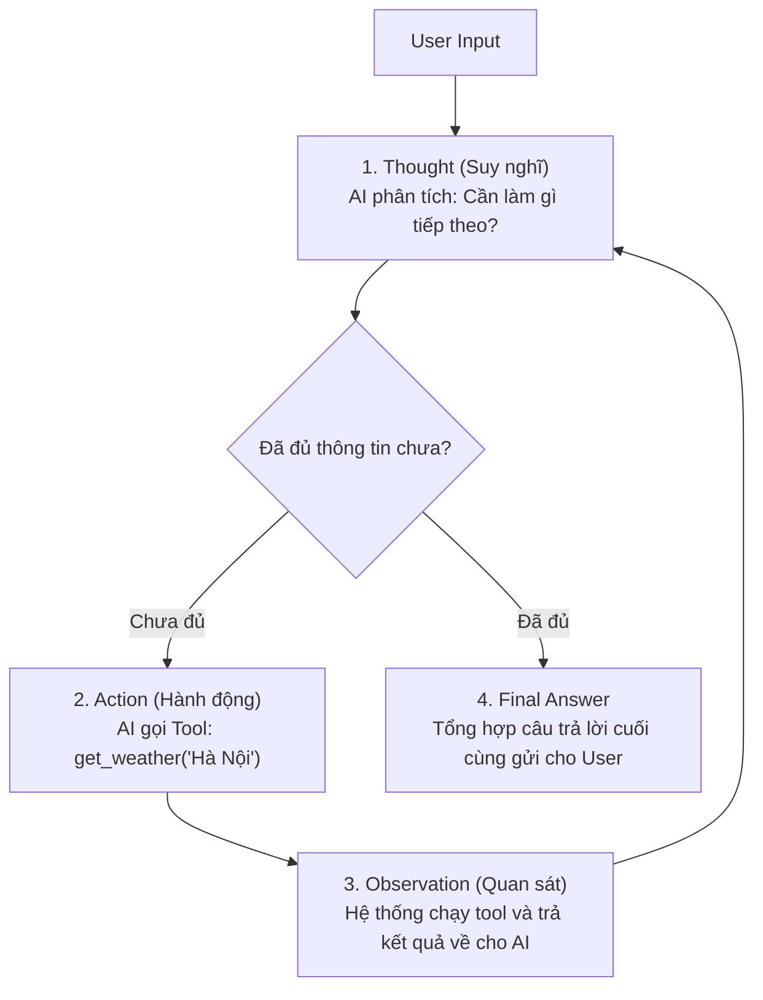

# AI Agent & ReAct Framework Cheat Sheet

Tài liệu hướng dẫn toàn diện từ lý thuyết nền tảng đến thực chiến triển khai **AI Agent** và mô hình **ReAct (Reasoning + Acting)** trong hệ sinh thái LangChain & LangGraph.

---

## 1. Khái niệm cốt lõi: AI Agent là gì?

### So sánh Chain vs Agent

| Đặc tính | Chain thông thường (LCEL) | AI Agent |
| :--- | :--- | :--- |
| **Đường đi của luồng dữ liệu** | **Cố định (Hardcoded)**: Bước 1 $\rightarrow$ Bước 2 $\rightarrow$ Bước 3. | **Linh hoạt (Dynamic)**: AI tự quyết định đi đâu tiếp theo. |
| **Khả năng giải quyết bài toán**| Chỉ làm đúng 1 nhiệm vụ đã được định nghĩa từ trước. | Tự chia nhỏ bài toán phức tạp thành nhiều bước để giải quyết. |
| **Công cụ (Tools)** | Không có hoặc chạy cố định theo thứ tự. | AI tự chọn công cụ thích hợp, tự sửa sai nếu công cụ trả về lỗi. |

### Công thức cấu tạo nên một AI Agent:
$$\text{Agent} = \text{LLM (Bộ não)} + \text{Tools (Đôi tay)} + \text{Planning (Lập kế hoạch)} + \text{Memory (Bộ nhớ)}$$

- **Bộ não (LLM):** Tiếp nhận yêu cầu, suy luận logic, trích xuất tham số.
- **Đôi tay (Tools):** Các hàm Python gọi API, tra cứu Database, tính toán, cào web.
- **Lập kế hoạch (Planning):** Vòng lặp ReAct suy nghĩ trước khi hành động.
- **Bộ nhớ (Memory):** Lưu trữ ngữ cảnh qua nhiều lượt hội thoại (`thread_id`).

---

## 2. Mô hình ReAct (Reasoning + Acting)

Được giới thiệu trong bài báo khoa học của *Yao et al. (2022)*. Thay vì chỉ suy nghĩ (Chain-of-Thought) hoặc chỉ hành động mù quáng (Act-only), ReAct kết hợp cả hai thành **vòng lặp liên tục**:



### Ví dụ luồng ReAct thực tế:
- **User:** *"Thời tiết Hà Nội hôm nay thế nào và nếu nhân đôi nhiệt độ thì bằng bao nhiêu?"*
- 🧠 **Thought 1:** Mình cần biết nhiệt độ Hà Nội trước.
- ⚡ **Action 1:** Gọi tool `get_weather(city="Hanoi")`.
- 👁️ **Observation 1:** `32°C, trời nắng`.
- 🧠 **Thought 2:** Đã có nhiệt độ là 32. Bây giờ mình cần tính $32 \times 2$.
- ⚡ **Action 2:** Gọi tool `calculate(expression="32 * 2")`.
- 👁️ **Observation 2:** `64`.
- 🧠 **Thought 3:** Đã có đủ cả thông tin thời tiết lẫn phép tính. Không cần gọi thêm tool nào nữa.
- 🎯 **Final Answer:** *"Thời tiết Hà Nội hôm nay là 32°C. Nếu nhân đôi nhiệt độ này thì sẽ là 64°C."*

---

## 3. Giao thức Tool Calling chuẩn (Dưới nắp ca-pô)

Khi không dùng Framework cao cấp, một vòng lặp ReAct thuần túy hoạt động như sau:

```python
import json
from groq import AsyncGroq

client = AsyncGroq()
messages = [{"role": "user", "content": "Thời tiết ở Hà Nội hôm nay thế nào?"}]

# 1. Gửi tin nhắn và danh sách tools
response = await client.chat.completions.create(
    model="openai/gpt-oss-120b",
    messages=messages,
    tools=tools,
    tool_choice="auto"
)
message = response.choices[0].message
messages.append(message)

# 2. VÒNG LẶP REACT (Chạy chừng nào AI còn yêu cầu gọi tool)
while message.tool_calls:
    for tool_call in message.tool_calls:
        # Bóc tách tên hàm và tham số
        fn_name = tool_call.function.name
        fn_args = json.loads(tool_call.function.arguments)
        
        # Thực thi hàm ở máy của bạn
        result = await execute_tool(fn_name, fn_args)
        
        # Gửi kết quả lại cho LLM (BẮT BUỘC có tool_call_id)
        messages.append({
            "role": "tool",
            "tool_call_id": tool_call.id,
            "name": fn_name,
            "content": str(result)
        })
        
    # Gọi lại LLM với lịch sử mới
    response = await client.chat.completions.create(
        model="openai/gpt-oss-120b",
        messages=messages,
        tools=tools
    )
    message = response.choices[0].message
    messages.append(message)

# 3. Kết thúc vòng lặp, in câu trả lời cuối
print("Final Answer:", message.content)
```

> [!IMPORTANT]
> **Điểm cốt lõi:** LLM **không bao giờ tự chạy code**. LLM chỉ trả về tín hiệu `tool_calls` (văn bản). Chương trình của bạn mới là người thực sự chạy hàm và nhét kết quả lại cho LLM đọc.

---

## 4. Triển khai Agent trong LangChain & LangGraph (2024+)

### 4.1. Định nghĩa Tools bằng `@tool`
Không cần viết schema JSON thủ công. Docstring và Type Hint chính là linh hồn của Tool:

```python
from langchain_core.tools import tool

@tool
def calculate(expression: str) -> str:
    """Dùng khi cần tính toán biểu thức toán học phức tạp. Input là chuỗi biểu thức, ví dụ: '2 * 3.5 + 10'."""
    try:
        return str(eval(expression))
    except Exception as e:
        return f"Lỗi tính toán: {e}"

@tool
def rag_search(query: str) -> str:
    """Dùng khi cần tra cứu tài liệu kỹ thuật, thông tin nội bộ công ty hoặc kiến thức chuyên môn."""
    docs = retriever.invoke(query)
    return "\n\n".join(doc.page_content for doc in docs)
```

### 4.2. Phân biệt `.bind_tools()` vs `Agent`

| Cách làm | Cú pháp | Số bước chạy | Khi nào dùng? |
| :--- | :--- | :--- | :--- |
| **`.bind_tools()`** | `chain = prompt \| model.bind_tools(tools)` | **Đúng 1 lượt (Single-turn)**. Chỉ trả về yêu cầu `ai_msg.tool_calls`, **không tự chạy hàm**. | Khi bạn muốn tự kiểm soát luồng thực thi hàm hoặc xây dựng UI xác nhận của người dùng. |
| **`Agent`** | `agent = create_agent(model, tools, ...)` | **Tự động đa bước (Multi-turn loop)**. Tự gọi hàm, tự lấy kết quả nhét lại cho LLM đến khi xong. | Khi bạn muốn giao phó toàn bộ bài toán cho AI tự giải quyết từ A đến Z. |

### 4.3. Khởi tạo Agent tự động hoàn chỉnh

```python
from langchain_groq import ChatGroq
from langchain.agents import create_agent

model = ChatGroq(model="openai/gpt-oss-120b", temperature=0)
tools = [calculate, rag_search]

agent = create_agent(
    model=model,
    tools=tools,
    system_prompt="Bạn là trợ lý AI thông minh. Hãy dùng các công cụ được cung cấp để trả lời câu hỏi chính xác bằng tiếng Việt."
)

# Chạy Agent
query = "Nếu nhân đôi thời gian xử lý tác vụ YOLOv11n thì mất bao lâu?"
result = agent.invoke({"messages": [{"role": "user", "content": query}]})

# Kết quả cuối cùng
print(result["messages"][-1].content)
```

---

## 5. Quản lý Bộ nhớ & Trạng thái (Memory & State)

Mặc định, mỗi lần gọi `agent.invoke(...)` mới là Agent sẽ "mất trí nhớ". Để Agent nhớ được các câu trò chuyện trước đó, ta dùng **Checkpointer** (LangGraph):

```python
from langgraph.checkpoint.memory import MemorySaver
from langgraph.prebuilt import create_react_agent

# 1. Bộ nhớ lưu trữ trạng thái trong RAM (Production dùng PostgresSaver)
memory = MemorySaver()

# 2. Khởi tạo Agent có gắn bộ nhớ
agent_with_memory = create_react_agent(
    model=model,
    tools=tools,
    checkpointer=memory
)

# 3. Phân biệt người dùng bằng thread_id
config = {"configurable": {"thread_id": "user_session_123"}}

# Lượt 1: Giới thiệu thông tin
agent_with_memory.invoke(
    {"messages": [{"role": "user", "content": "Tôi tên là Nam, đang làm AI Engineer tại Hà Nội."}]},
    config=config
)

# Lượt 2: Kiểm tra trí nhớ (Không cần nhắc lại tên)
response = agent_with_memory.invoke(
    {"messages": [{"role": "user", "content": "Thời tiết nơi tôi đang ở hôm nay thế nào?"}]},
    config=config
)
# -> Agent tự nhớ "Hà Nội" để gọi get_weather(city="Hanoi")!
```

---

## 6. Những cạm bẫy thực tế & Best Practices (Phải nhớ)

### 1. "Docstring là Prompt của Tool"
- LLM chọn tool dựa vào **docstring**. Nếu docstring viết mập mờ, AI sẽ chọn sai tool hoặc không thèm gọi tool.
- ❌ **Xấu:** `"""Hàm tính toán."""`
- ✅ **Chuẩn:** `"""Dùng khi người dùng cần tính toán biểu thức toán học, cộng trừ nhân chia. Input là chuỗi biểu thức hợp lệ."""`

### 2. Luôn có `try...except` phòng thủ trong mọi Tool
- Nếu hàm tool của bạn bị crash ném ra Exception không được xử lý, toàn bộ Agent sẽ bị sập.
- Hãy luôn bọc `try...except` và trả về chuỗi thông báo lỗi. LLM sẽ đọc chuỗi lỗi đó để tự sửa ở vòng lặp tiếp theo.

### 3. Đặt giới hạn vòng lặp (`recursion_limit` / `max_iterations`)
- Nếu bài toán quá khó hoặc Tool liên tục trả về lỗi, Agent có thể rơi vào **vòng lặp vô tận (Infinite Loop)** làm cháy sạch tài khoản API Key.
- Luôn đặt giới hạn:
  ```python
  agent.invoke(inputs, config={"recursion_limit": 10}) # Tối đa 10 bước suy luận
  ```

---

## 7. Bảng tổng hợp các kiến trúc Agent

```text
1. ReAct Agent        : [Nghĩ] -> [Gọi Tool] -> [Quan sát] -> Lặp lại (Chuẩn phổ biến nhất)
2. Plan-and-Solve    : [Lập kế hoạch toàn bộ các bước trước] -> [Thực thi từng bước]
3. Router Agent      : [Phân loại ý định người dùng] -> [Rẽ nhánh sang Chain chuyên biệt]
4. Multi-Agent       : Nhiều Agent chuyên biệt (Coder, Reviewer, Tester) nói chuyện với nhau (LangGraph)
```
