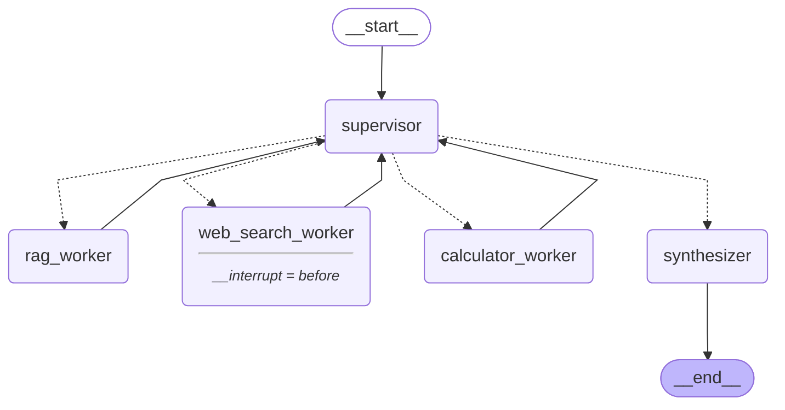

# Sơ đồ Kiến trúc LangGraph Capstone

```mermaid
---
config:
  flowchart:
    curve: linear
---
graph TD;
	__start__([<p>__start__</p>]):::first
	supervisor(supervisor)
	rag_worker(rag_worker)
	web_search_worker(web_search_worker<hr/><small><em>__interrupt = before</em></small>)
	calculator_worker(calculator_worker)
	synthesizer(synthesizer)
	__end__([<p>__end__</p>]):::last
	__start__ --> supervisor;
	calculator_worker --> supervisor;
	rag_worker --> supervisor;
	supervisor -.-> calculator_worker;
	supervisor -.-> rag_worker;
	supervisor -.-> synthesizer;
	supervisor -.-> web_search_worker;
	web_search_worker --> supervisor;
	synthesizer --> __end__;
	classDef default fill:#f2f0ff,line-height:1.2
	classDef first fill-opacity:0
	classDef last fill:#bfb6fc

```
