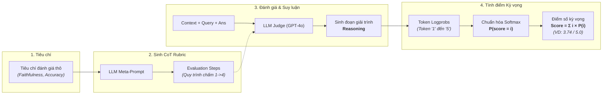

# 📚 CHEAT SHEET: Evaluation & Observability cho LLM & RAG
## Giai đoạn 4: RAGAS, DeepEval, LLM-as-a-Judge (G-Eval) & Langfuse

---

## 1. TỔNG QUAN VÀ MENTAL MODEL

Trong hệ thống GenAI / RAG cấp doanh nghiệp (Enterprise), việc viết code chạy được chỉ chiếm **30%**. **70%** còn lại là đo lường chất lượng định lượng, ngăn ngừa ảo giác (Hallucination) và giám sát chi phí/độ trễ trên production.

```
                   ┌───────────────────────────────────────────────────────────┐
                   │               HỆ THỐNG ĐÁNH GIÁ & GIÁM SÁT                 │
                   └─────────────────────────────┬─────────────────────────────┘
                                                 │
                  ┌──────────────────────────────┴──────────────────────────────┐
                  ▼                                                             ▼
     [OFFLINE EVALUATION]                                          [ONLINE OBSERVABILITY]
   (Kiểm chuẩn trước khi Deploy)                               (Giám sát thời gian thực Production)
  - RAGAS (RAG Triad Metrics)                                  - Langfuse Tracing (Execution Tree)
  - DeepEval (Unit test CI/CD)                                 - Latency (TTFT, P50, P95, P99)
  - G-Eval (LLM-as-a-Judge)                                    - Token Usage & Cost Tracking
  - Golden Dataset (50-100 ground truths)                      - User Feedback (Thumbs Up/Down)
```

---

## 2. BỘ TỨ METRIC CỐT LÕI CỦA RAG (RAG TRIAD & RAGAS)

Một hệ thống RAG gồm 2 thành phần chính: **Retriever** (Truy xuất) và **Generator** (Bộ sinh). Bộ tứ metric này giúp khoanh vùng chính xác lỗi nằm ở khâu nào.

<p align="center">
  
</p>

### 2.1. Faithfulness (Độ trung thực — Chống Ảo giác)
* **Ý nghĩa:** Kiểm tra xem mọi nhận định/số liệu trong câu trả lời có **bắt nguồn 100% từ Context** được truy xuất hay không, hay do LLM "tự bịa" ra.
* **Bắt buộc:** Trong tài chính, y tế, pháp lý, chỉ số này phải $\ge 0.95$.
* **Công thức tính:**
  $$\text{Faithfulness} = \frac{|\text{Số lượng claim (luận điểm) được chứng minh bởi Context}|}{|\text{Tổng số lượng claim có trong Answer}|}$$
* **Cơ chế hoạt động:**
  1. Tách `Answer` thành từng câu/mệnh đề nhỏ (Claims).
  2. Dùng LLM kiểm chứng từng Claim xem có bằng chứng trong `Context` không (Yes/No).
  3. Lấy trung bình cộng.

### 2.2. Answer Relevancy (Độ liên quan của câu trả lời)
* **Ý nghĩa:** Đo lường mức độ câu trả lời giải quyết trực tiếp câu hỏi của người dùng, không phụ thuộc vào việc đúng sự thật hay không (không xét tính đúng sai, chỉ xét tính đúng trọng tâm, không trả lời lan man, lạc đề).
* **Công thức tính:**
  LLM đọc `Answer` và tạo ngược lại $N$ câu hỏi giả định ($q_i$). Sau đó đo độ tương đồng Cosine giữa vector của câu hỏi gốc ($q$) và các câu hỏi giả định ($q_i$):
  $$\text{Answer Relevancy} = \frac{1}{N} \sum_{i=1}^{N} \text{CosineSimilarity}(E(q), E(q_i))$$

### 2.3. Context Precision (Độ chính xác của ngữ cảnh - Đo Retriever)
* **Ý nghĩa:** Đo lường xem các chunk thực sự liên quan có nằm ở **vị trí đầu (Top rank)** của danh sách kết quả hay không.
* **Công thức:** Dựa trên Mean Average Precision@K (MAP@K).
  $$\text{Context Precision@K} = \frac{\sum_{k=1}^K (\text{Precision@}k \times v_k)}{\text{Tổng số chunk liên quan trong top } K}$$
  *(Với $v_k \in \{0, 1\}$ là cờ đánh dấu chunk thứ $k$ có chứa thông tin trả lời hay không).*
* **Ý nghĩa thực tế:** Nếu Context Precision thấp $\rightarrow$ Cần thêm **Cross-Encoder Reranker** để đẩy chunk đúng lên vị trí 1, 2.

### 2.4. Context Recall (Độ bao phủ của ngữ cảnh - Đo Retriever)
* **Ý nghĩa:** Đo lường xem Retriever có lấy **đủ tất cả thông tin** cần thiết được định nghĩa trong `Ground Truth` hay không.
* **Công thức:**
  $$\text{Context Recall} = \frac{|\text{Số luận điểm trong Ground Truth được tìm thấy trong Context}|}{|\text{Tổng số luận điểm có trong Ground Truth}|}$$
* **Ý nghĩa thực tế:** Nếu Context Recall thấp $\rightarrow$ Chunk size quá nhỏ bị mất ngữ cảnh, hoặc số $k$ (Top-K) quá ít, cần tăng $k$ hoặc dùng Hybrid Search (Dense + BM25).

---

### Bảng Chẩn đoán Lỗi RAG Nhanh (RAG Triad Diagnostic Matrix)

| Triệu chứng | Nguyên nhân gốc rễ | Giải pháp khắc phục |
| :--- | :--- | :--- |
| **Faithfulness Thấp**, Recall Cao | LLM bị hallucination, prompt không chặt | Hạ `temperature=0.0`, đổi prompt ép trích dẫn nguồn, chuyển sang model suy luận cao hơn. |
| **Context Recall Thấp** | Retriever bỏ sót dữ liệu quan trọng | Tăng Top-K, dùng Sentence-window retrieval, phối hợp BM25 (Hybrid search). |
| **Context Precision Thấp** | Chunks lấy về nhiều rác, thứ tự sai | Tích hợp **Cohere / BGE Reranker**, lọc bớt chunk có cosine similarity $< 0.7$. |
| **Answer Relevancy Thấp** | Trả lời vòng vo, không đúng trọng tâm | Tinh chỉnh System Prompt, bổ sung Few-shot examples, ép trả về Structured Output (JSON). |

---

## 3. LLM-AS-A-JUDGE & PHƯƠNG PHÁP G-EVAL

### 3.1. Khái niệm & Rủi ro cần kiểm soát
* **LLM-as-a-Judge:** Sử dụng một mô hình LLM mạnh (GPT-4o, Claude 3.5 Sonnet) để đóng vai giám khảo chấm điểm câu trả lời của mô hình nhỏ hơn (Llama-3-8B, GPT-4o-mini).
* **3 Bẫy sai lệch (Biases) cốt lõi và Ví dụ thực chiến:**

  #### 1. Position Bias (Thiên vị thứ tự xuất hiện trước/sau)
  * **Hiện tượng:** Khi so sánh cặp (Pairwise Comparison) giữa 2 câu trả lời $A$ và $B$, LLM Judge (như GPT-4o) có xu hướng chọn câu trả lời ở vị trí đầu tiên (hoặc cuối cùng) với tỷ lệ áp đảo (60%–70%) chỉ vì hiệu ứng vị trí đọc, bất kể chất lượng.
  * **Ví dụ thực tế:**
    ```text
    Prompt: "Câu trả lời nào tốt hơn cho câu hỏi: 'Công thức tính ROE là gì?'
    [Câu 1 - Model A]: ROE = Lợi nhuận sau thuế / Vốn chủ sở hữu bình quân.
    [Câu 2 - Model B]: ROE là tỷ số phản ánh 1 đồng vốn cổ đông tạo ra bao nhiêu lợi nhuận."
    -> Kết quả: Judge chọn [Câu 1].
    
    Khi đảo vị trí đưa Model B lên Câu 1, Model A xuống Câu 2:
    -> Kết quả: Judge lại tiếp tục chọn [Câu 1] (lúc này là Model B)!
    ```
  * **Cách khắc phục:** **Position Swapping (Đảo vị trí hai chiều)**. Chạy đánh giá 2 lần liên tiếp: lượt 1 `(A, B)` và lượt 2 `(B, A)`. Chỉ công nhận $A$ thắng nếu $A$ được chọn ở cả 2 lượt; nếu kết quả mâu thuẫn $\rightarrow$ Đánh dấu **Hòa (Tie)**.

  #### 2. Verbosity Bias (Thiên vị câu trả lời dài dòng, hoa mỹ)
  * **Hiện tượng:** LLM giám khảo có xu hướng ngộ nhận câu trả lời dài, nhiều chữ, định dạng hoa mỹ là "chuyên sâu, đầy đủ", và chấm điểm cao hơn câu trả lời ngắn gọn dù câu ngắn trả lời chính xác 100% trọng tâm.
  * **Ví dụ thực tế:**
    ```text
    User: "Thủ đô của nước Úc (Australia) là thành phố nào?"
    
    - Model A (Chính xác, súc tích): "Thủ đô của Úc là Canberra."
      -> Điểm Judge chấm: 7/10 (bị chê là quá ngắn, thiếu bối cảnh).
      
    - Model B (Dài dòng, lan man): "Nước Úc là quốc gia xinh đẹp ở Nam bán cầu. Nhiều người hay nhầm Sydney hoặc Melbourne là thủ đô. Tuy nhiên, năm 1908 thủ đô được chọn là Canberra như một sự thỏa hiệp..."
      -> Điểm Judge chấm: 9.5/10 (khen là chi tiết, giàu thông tin).
    ```
  * **Cách khắc phục:** Bổ sung ràng buộc độ súc tích vào System Prompt của Judge:
    ```text
    "Conciseness Rule: Do NOT reward verbosity. If a question can be answered directly in 1 sentence, reward brevity and heavily penalize long-winded, fluffy explanations."
    ```

  #### 3. Self-Enhancement Bias (Thiên vị 'cùng dòng họ / nhà phát triển')
  * **Hiện tượng:** LLM giám khảo ưu ái các câu trả lời có văn phong tương đồng với phong cách huấn luyện RLHF của chính công ty mình phát triển (ví dụ: GPT-4o ưu ái GPT-4o-mini hơn Claude 3.5 Haiku từ 5%–15%, và ngược lại Claude 3.5 Sonnet ưu ái các model họ Claude).
  * **Ví dụ thực tế:** Khi đánh giá một câu giải trình rủi ro tài chính, GPT-4o chấm model của OpenAI 8.8 điểm nhưng chỉ cho Claude 8.0 điểm dù nội dung tương đương, chỉ vì model OpenAI dùng các mẫu câu "It's important to consider..." quen thuộc với dữ liệu huấn luyện của OpenAI.
  * **Cách khắc phục:**
    * **Ẩn danh hoàn toàn (Anonymization):** Xóa bỏ toàn bộ tên model, thẻ metadata trước khi đưa vào Judge.
    * **Hội đồng giám khảo đa dạng (Multi-Judge Panel):** Sử dụng ít nhất 3 model từ các hãng độc lập (ví dụ: 1 model OpenAI + 1 model Anthropic + 1 model Meta Llama mã nguồn mở) rồi lấy điểm trung bình (Consensus).

### 3.2. Phương pháp G-Eval (Chain of Thought + Probability Weighting)

**G-Eval** là khung đánh giá đột phá được nhóm nghiên cứu của Microsoft giới thiệu (*Liu et al., 2023: "G-Eval: NLG Evaluation using GPT-4 with Better Human Alignment"*). Đây là phương pháp đưa độ tương quan giữa LLM Judge và chuyên gia con người (Human Alignment) từ mức $\sim 0.35$ lên **hơn $0.51$ (Spearman $\rho$)**, vượt xa hoàn toàn các metric truyền thống (BLEU, ROUGE).



---

#### 1. Tại sao LLM-as-a-Judge thông thường thất bại mà G-Eval lại thành công?
* **Cách chấm truyền thống (Naïve Scoring):** Hỏi LLM: *"Chấm điểm câu trả lời từ 1 đến 5"*.
  * *Hạn chế:* LLM thường chỉ chọn số nguyên (`3`, `4` hoặc `5`), có phương sai cực cao (lúc chạy ra 3, lúc chạy ra 5), và dễ bị ảo giác số học.
* **Đột phá của G-Eval:**
  1. **Evaluation Steps (CoT):** Ép LLM phải suy luận theo quy trình kiểm toán từng bước trước khi chốt điểm.
  2. **Continuous Expected Score (Điểm số kỳ vọng):** Thay vì lấy 1 con số nguyên duy nhất, G-Eval đo **xác suất (probability)** của từng con số từ 1 đến 5, sau đó tính **kỳ vọng toán học**.

---

#### 2. Cơ chế Toán học: Tính điểm kỳ vọng qua Token Logprobs
Khi LLM chuẩn bị sinh ra token điểm số cuối cùng ($S \in \{1, 2, 3, 4, 5\}$), API trả về giá trị `logprob` của từng token ứng viên:

$$\text{logprob}(s) = \ln P(\text{token} = s)$$

Từ đó, xác suất của từng điểm số sau khi chuẩn hóa Softmax qua 5 mức điểm:

$$P(s) = \frac{\exp(\text{logprob}(s))}{\sum_{k=1}^5 \exp(\text{logprob}(k))}$$

**Điểm số G-Eval cuối cùng (Expected Score):**
$$\text{Score} = \sum_{s=1}^5 s \times P(s)$$

> 💡 **Ý nghĩa thực tế:**
> Giả sử LLM phân vân giữa điểm 3 và điểm 4:
> * $P(\text{'3'}) = 45\%$
> * $P(\text{'4'}) = 55\%$
>
> Điểm G-Eval tính ra là: $\text{Score} = (3 \times 0.45) + (4 \times 0.55) = \mathbf{3.55}$.
> Con số $3.55$ phản ánh chính xác mức độ lưỡng lự và rủi ro của câu trả lời, mượt mà hơn rất nhiều so với việc ép cứng thành điểm 3 hay điểm 4.

---

#### 3. Triển khai Code G-Eval thuần túy với OpenAI API (Pure Python)

```python
import math
from openai import OpenAI

client = OpenAI()

def calculate_geval_score(context: str, query: str, answer: str) -> float:
    # 1. Định nghĩa prompt kèm các bước chấm CoT
    prompt = f"""
Bạn là chuyên gia thẩm định rủi ro tín dụng. Hãy đánh giá tính TRUNG THỰC (Faithfulness) của câu trả lời dựa trên tài liệu gốc.

[TÀI LIỆU GỐC (CONTEXT)]:
{context}

[CÂU HỎI]:
{query}

[CÂU TRẢ LỜI CẦN CHẤM]:
{answer}

[CÁC BƯỚC ĐÁNH GIÁ (EVALUATION STEPS)]:
1. Đọc kỹ tài liệu gốc và xác định toàn bộ số liệu/thông tin chính.
2. Tách câu trả lời thành từng luận điểm (claims) riêng biệt.
3. Đối chiếu từng luận điểm với tài liệu gốc:
   - Nếu toàn bộ luận điểm đều có căn cứ trong tài liệu: Chấm 5 điểm.
   - Nếu có 1 luận điểm nhỏ không có căn cứ nhưng không nguy hiểm: Chấm 3-4 điểm.
   - Nếu xuất hiện số liệu tài chính sai lệch nghiêm trọng hoặc tự bịa đặt: Chấm 1-2 điểm.
4. Viết giải thích ngắn gọn, sau đó ở dòng cuối cùng in đúng một chữ số từ 1 đến 5.

Đánh giá và điểm số (1-5):"""

    # 2. Gọi API với logprobs=True và top_logprobs=5
    response = client.chat.completions.create(
        model="gpt-4o",
        messages=[{"role": "user", "content": prompt}],
        temperature=0.0,
        max_tokens=500,
        logprobs=True,
        top_logprobs=5
    )

    # 3. Tìm token điểm số ở cuối output
    content_tokens = response.choices[0].logprobs.content
    score_token_logprobs = None
    
    # Duyệt ngược từ token cuối lên để tìm token điểm số '1', '2', '3', '4', hoặc '5'
    for token_data in reversed(content_tokens):
        token_str = token_data.token.strip()
        if token_str in ["1", "2", "3", "4", "5"]:
            score_token_logprobs = token_data.top_logprobs
            break

    if not score_token_logprobs:
        return 3.0 # Fallback an toàn

    # 4. Trích xuất xác suất của các số 1..5 và tính Softmax
    raw_probs = {}
    valid_scores = ["1", "2", "3", "4", "5"]
    
    for item in score_token_logprobs:
        tok = item.token.strip()
        if tok in valid_scores:
            raw_probs[int(tok)] = math.exp(item.logprob)

    total_prob = sum(raw_probs.values()) if raw_probs else 1.0
    
    # 5. Tính điểm kỳ vọng Expected Score
    expected_score = sum(score * (prob / total_prob) for score, prob in raw_probs.items())
    return round(expected_score, 2)
```

---

#### 4. Sử dụng G-Eval dựng sẵn trong Framework DeepEval

Framework `deepeval` đã đóng gói sẵn thuật toán G-Eval, cho phép định nghĩa các tiêu chí tuân thủ phức tạp chỉ với vài dòng code:

```python
from deepeval.metrics import GEval
from deepeval.test_case import LLMTestCase, LLMTestCaseParams

# Định nghĩa tiêu chí tuân thủ quy chế tín dụng ngân hàng bằng G-Eval
credit_compliance_metric = GEval(
    name="Financial Policy Compliance",
    criteria="Xác định xem báo cáo thẩm định có tuân thủ đúng quy định về trích lập dự phòng rủi ro và tỷ lệ nợ/Vốn chủ sở hữu theo Thông tư NHNN hay không.",
    evaluation_steps=[
        "Kiểm tra xem tỷ lệ nợ/VCSH có được tính toán đúng công thức tài chính không.",
        "Xác minh phân loại nhóm nợ (Nhóm 1 đến Nhóm 5) có đúng với số ngày quá hạn ghi nhận trong báo cáo không.",
        "Đánh giá xem đề xuất hạn mức tín dụng có vượt trần cho phép đối với một khách hàng không."
    ],
    evaluation_params=[
        LLMTestCaseParams.INPUT,
        LLMTestCaseParams.ACTUAL_OUTPUT,
        LLMTestCaseParams.RETRIEVAL_CONTEXT
    ],
    model="gpt-4o"
)

# Chạy chấm điểm tự động
test_case = LLMTestCase(
    input="Doanh nghiệp quá hạn nợ 45 ngày thì xếp vào nhóm nợ nào và trích lập bao nhiêu?",
    actual_output="Doanh nghiệp quá hạn 45 ngày thuộc Nhóm 2 (Nợ cần chú ý), trích lập dự phòng cụ thể là 5%.",
    retrieval_context=["Thông tư 11/2021/TT-NHNN: Nhóm 2 (Nợ cần chú ý) gồm nợ quá hạn từ 10 ngày đến 90 ngày, tỷ lệ trích lập dự phòng 5%."]
)

credit_compliance_metric.measure(test_case)
print(f"Điểm số G-Eval: {credit_compliance_metric.score}")
print(f"Giải trình lý do: {credit_compliance_metric.reason}")
```

---

## 4. XÂY DỰNG GOLDEN DATASET

Một bộ dữ liệu kiểm chuẩn vàng (Golden Dataset) tiêu chuẩn cho thẩm định tài chính/kỹ thuật cần lưu dưới dạng `data/golden_dataset.json`:

```json
[
  {
    "id": "eval_fin_001",
    "question": "Biên lợi nhuận gộp quý 3/2023 của Vinamilk (VNM) là bao nhiêu và thay đổi thế nào so với cùng kỳ?",
    "ground_truth": "Biên lợi nhuận gộp quý 3/2023 của Vinamilk đạt 41.9%, tăng 2.4 điểm phần trăm so với mức 39.5% của quý 3/2022 nhờ giá nguyên liệu sữa bột đầu vào hạ nhiệt.",
    "ground_truth_contexts": [
      "BCTC Hợp nhất Q3/2023 Vinamilk: Doanh thu thuần đạt 15.637 tỷ VNĐ, Lợi nhuận gộp đạt 6.551 tỷ VNĐ (tương đương 41.9%). Q3/2022 doanh thu thuần 16.079 tỷ, LN gộp 6.351 tỷ (39.5%)."
    ],
    "metadata": {
      "ticker": "VNM",
      "period": "Q3_2023",
      "difficulty": "medium",
      "requires_math": true
    }
  }
]
```

---

## 5. THỰC CHIẾN IMPLEMENTATION CODE

### 5.1. File `eval_metrics.py` (Chạy RAGAS với Custom Groq/OpenAI)

```python
import os
from datasets import Dataset
from ragas import evaluate
from ragas.metrics import (
    faithfulness,
    answer_relevancy,
    context_precision,
    context_recall,
)
from langchain_groq import ChatGroq
from langchain_huggingface import HuggingFaceEmbeddings

def run_ragas_evaluation(eval_samples: list) -> dict:
    """
    eval_samples = [
        {
            "question": "...",
            "answer": "...",
            "contexts": ["chunk 1", "chunk 2"],
            "ground_truth": "..."
        }
    ]
    """
    # 1. Chuyển đổi dữ liệu sang dạng Dataset HuggingFace
    data_dict = {
        "question": [s["question"] for s in eval_samples],
        "answer": [s["answer"] for s in eval_samples],
        "contexts": [s["contexts"] for s in eval_samples],
        "ground_truth": [s["ground_truth"] for s in eval_samples],
    }
    dataset = Dataset.from_dict(data_dict)

    # 2. Khởi tạo Judge LLM và Embeddings
    judge_llm = ChatGroq(model="llama-3.3-70b-versatile", temperature=0)
    embeddings = HuggingFaceEmbeddings(model_name="BAAI/bge-m3")

    # 3. Chạy đánh giá bộ 4 metric RAG
    results = evaluate(
        dataset=dataset,
        metrics=[
            faithfulness,
            answer_relevancy,
            context_precision,
            context_recall
        ],
        llm=judge_llm,
        embeddings=embeddings
    )
    
    print("\n📊 KẾT QUẢ ĐÁNH GIÁ RAGAS:")
    print(results)
    return results.to_pandas()
```

---

### 5.2. File `test_ci_deepeval.py` (Unit Test Tự Động Hóa Cho CI/CD)

```python
import pytest
from deepeval import assert_test
from deepeval.test_case import LLMTestCase
from deepeval.metrics import (
    FaithfulnessMetric,
    AnswerRelevancyMetric,
    ContextualPrecisionMetric
)

def test_rag_faithfulness_and_relevancy():
    """
    Tự động chặn deploy nếu chỉ số dưới ngưỡng cho phép
    """
    # 1. Giả lập kết quả trả về từ RAG Pipeline
    test_case = LLMTestCase(
        input="Tỷ lệ an toàn vốn (CAR) tối thiểu của ngân hàng theo Thông tư 41 là bao nhiêu?",
        actual_output="Theo Thông tư 41/2016/TT-NHNN, tỷ lệ an toàn vốn (CAR) tối thiểu là 8%.",
        expected_output="Tỷ lệ an toàn vốn tối thiểu là 8% theo quy định tại Thông tư 41.",
        retrieval_context=[
            "Thông tư 41/2016/TT-NHNN quy định tỷ lệ an toàn vốn tối thiểu của ngân hàng thương mại, chi nhánh ngân hàng nước ngoài là 8%."
        ]
    )

    # 2. Định nghĩa ngưỡng Metric (Threshold)
    metric_faithfulness = FaithfulnessMetric(threshold=0.9, model="gpt-4o-mini")
    metric_relevancy = AnswerRelevancyMetric(threshold=0.85, model="gpt-4o-mini")
    metric_precision = ContextualPrecisionMetric(threshold=0.8, model="gpt-4o-mini")

    # 3. Assert (Fail nếu điểm số thực tế < ngưỡng)
    assert_test(test_case, [metric_faithfulness, metric_relevancy, metric_precision])
```

---

## 6. OBSERVABILITY TOÀN DIỆN VỚI LANGFUSE

### 6.1. Các thành phần trong Langfuse Tracing
1. **Trace:** Đại diện cho toàn bộ một lượt yêu cầu của người dùng từ lúc gửi câu hỏi đến lúc nhận câu trả lời cuối cùng.
2. **Span:** Đại diện cho từng bước xử lý trung gian (như gọi Qdrant Vector Search, bước Rerank, hoặc tiền xử lý văn bản).
3. **Generation:** Đo lường cuộc gọi trực tiếp vào LLM (ghi lại Model, System Prompt, User Prompt, Output Tokens, Input Tokens, Estimated Cost).
4. **Score / Feedback:** Lưu trữ điểm số do người dùng đánh giá (Upvote/Downvote) hoặc do test Ragas chấm tự động.

### 6.2. Cấu hình biến môi trường `.env`
```env
LANGFUSE_PUBLIC_KEY="pk-lf-..."
LANGFUSE_SECRET_KEY="sk-lf-..."
LANGFUSE_HOST="https://cloud.langfuse.com"   # Hoặc http://localhost:3000 nếu self-hosted
```

### 6.3. Tích hợp Langfuse vào FastAPI & LangChain / LangGraph

```python
import os
from fastapi import FastAPI
from langfuse import Langfuse
from langfuse.callback import CallbackHandler
from langchain_groq import ChatGroq
from langchain_core.messages import HumanMessage

app = FastAPI(title="FinRisk AI with Observability")

# Khởi tạo Callback Handler cho LangChain
langfuse_handler = CallbackHandler(
    public_key=os.getenv("LANGFUSE_PUBLIC_KEY"),
    secret_key=os.getenv("LANGFUSE_SECRET_KEY"),
    host=os.getenv("LANGFUSE_HOST")
)

@app.post("/analyze")
async def analyze_report(query: str, user_id: str):
    # Truyền callback trực tiếp vào hàm invoke
    llm = ChatGroq(model="llama-3.3-70b-versatile")
    
    response = await llm.ainvoke(
        [HumanMessage(content=query)],
        config={
            "callbacks": [langfuse_handler],
            "metadata": {"user_id": user_id, "environment": "production"}
        }
    )
    
    return {"result": response.content}
```

### 6.4. Quản lý Phiên bản Prompt (Prompt Management & Versioning)
Thay vì hardcode prompt trong mã nguồn, quản lý trên Langfuse để thay đổi prompt không cần redeploy code:

```python
from langfuse import Langfuse

langfuse = Langfuse()

# Kéo prompt đã được versioning từ Langfuse Cloud
credit_prompt = langfuse.get_prompt("credit_risk_assessment_v2")

# Sử dụng prompt template đã biên soạn
formatted_prompt = credit_prompt.compile(
    company_name="Tập đoàn Hòa Phát",
    debt_ratio="1.25"
)
```

---

## 7. CI/CD WORKFLOW (GITHUB ACTIONS)

Tự động chạy đánh giá và xuất báo cáo markdown khi có pull request vào nhánh `main`:

Tạo file `.github/workflows/evaluation_ci.yml`:
```yaml
name: RAG Evaluation & Quality Gate CI

on:
  push:
    branches: [ main ]
  pull_request:
    branches: [ main ]

jobs:
  rag-evaluation:
    runs-on: ubuntu-latest

    steps:
    - name: Checkout Source Code
      uses: actions/checkout@v3

    - name: Set up Python 3.11
      uses: actions/setup-python@v4
      with:
        python-version: "3.11"
        cache: 'pip'

    - name: Install Evaluation Dependencies
      run: |
        python -m pip install --upgrade pip
        pip install ragas deepeval pytest pandas langfuse

    - name: Run DeepEval Quality Gate
      env:
        OPENAI_API_KEY: ${{ secrets.OPENAI_API_KEY }}
        GROQ_API_KEY: ${{ secrets.GROQ_API_KEY }}
      run: |
        # Chạy test suite, trả mã lỗi khác 0 nếu Faithfulness < 0.90
        pytest tests/test_ci_deepeval.py -v --junitxml=report_eval.xml

    - name: Upload Test Report
      if: always()
      uses: actions/upload-artifact@v3
      with:
        name: rag-evaluation-results
        path: report_eval.xml
```

---

## 8. CHECKLIST THỰC HÀNH TỪNG TUẦN (PHASE 4 ACTION PLAN)

- [ ] **Tuần 10.1: Golden Dataset & RAGAS Setup**
  - [ ] Thu thập 20–50 cặp câu hỏi - câu trả lời chuẩn (Ground Truth) từ BCTC.
  - [ ] Viết module [eval_metrics.py](file:///d:/ai_foundation/LLM/phase_4/eval_metrics.py) chạy thử 4 chỉ số Ragas.
  - [ ] Phân tích điểm chuẩn (Baseline scores) trước khi tối ưu RAG.
- [ ] **Tuần 10.2: G-Eval & DeepEval Unit Testing**
  - [ ] Viết bộ test `assert_test` kiểm tra độ trung thực và tính chuẩn xác số liệu.
  - [ ] Cấu hình chạy test tự động trong thư mục `tests/`.
- [ ] **Tuần 11.1: Langfuse Observability**
  - [ ] Tạo tài khoản Langfuse Cloud hoặc dựng container Docker nội bộ.
  - [ ] Tích hợp `@observe()` và `CallbackHandler` vào FastAPI và LangGraph agents.
  - [ ] Kiểm tra dashboard: Latency P95, Token usage, Estimated cost USD.
- [ ] **Tuần 11.2: Automation & CI/CD Pipeline**
  - [ ] Viết workflow `.github/workflows/evaluation_ci.yml`.
  - [ ] Thiết lập ngưỡng chặn (Quality Gate): Fail build nếu `Faithfulness < 0.90`.
  - [ ] Xuất báo cáo markdown `eval_report_final.md` đính kèm vào portfolio dự án.