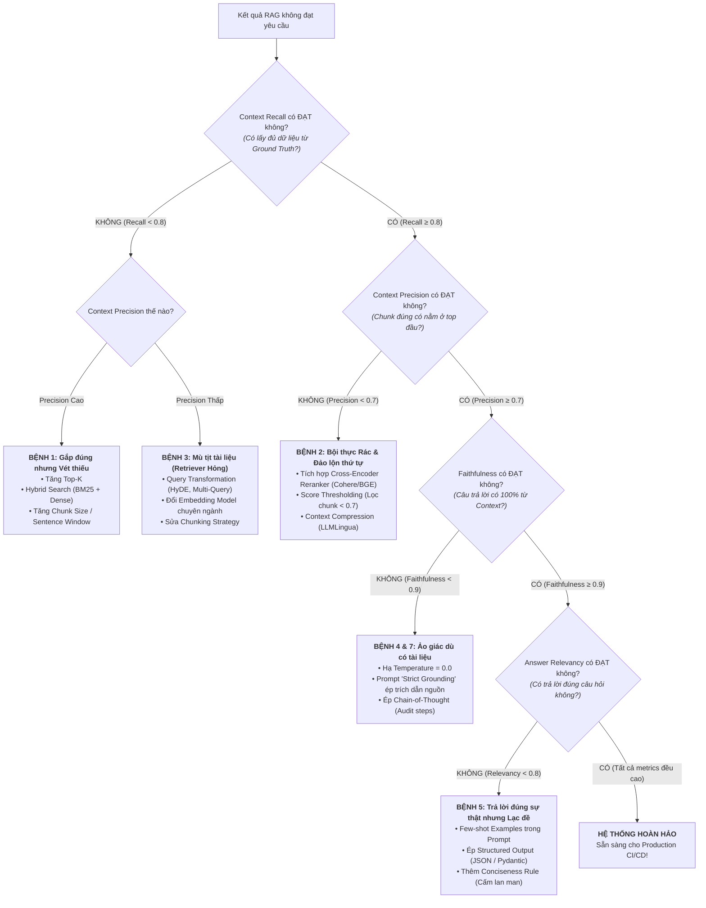

# 🩺 CẨM NANG CHẨN ĐOÁN & CẤP CỨU HỆ THỐNG RAG
## (RAG Diagnostic & Troubleshooting Cheatsheet)

---

## 1. MENTAL MODEL: RANH GIỚI TRÁCH NHIỆM TRONG RAG

Hệ thống RAG là một dây chuyền gồm 2 nhà máy độc lập: **Retriever (Tìm kiếm)** và **Generator (Sinh lời giải)**. Khi hệ thống cho ra kết quả tồi, **bắt buộc phải khoanh vùng lỗi nằm ở nhà máy nào** trước khi đụng vào code.

```
       [User Query]
            │
    ════════╪═════════════════════════════════════════════════════════════
    KHÂU 1: RETRIEVER (Bộ Truy Xuất Dữ Liệu)
    Chỉ chịu trách nhiệm tìm đúng và đủ Chunks liên quan từ Database.
    ---------------------------------------------------------------------
    Chỉ số kiểm chuẩn:
      ├── Context Recall:    Có lấy ĐỦ mọi mảnh ghép thông tin không?
      └── Context Precision: Các mảnh ghép đúng có nằm ở ĐẦU BẢNG không?
    ════════╪═════════════════════════════════════════════════════════════
            │ Context Chunks
            ▼
    ════════╪═════════════════════════════════════════════════════════════
    KHÂU 2: GENERATOR (LLM Tổng Hợp & Trả Lời)
    Chỉ chịu trách nhiệm đọc Context và trả lời đúng trọng tâm câu hỏi.
    ---------------------------------------------------------------------
    Chỉ số kiểm chuẩn:
      ├── Faithfulness:      Có TRUNG THỰC 100% với Context không (chống bịa)?
      └── Answer Relevancy:  Có trả lời ĐÚNG TRỌNG TÂM câu hỏi không?
    ════════╪═════════════════════════════════════════════════════════════
            │
            ▼
      [Final Answer]
```

> ⚠️ **ĐỊNH LUẬT CỐT TỬ CỦA RAG:**
> * **Garbage In $\rightarrow$ Hallucination Out:** Nếu Retriever đưa rác (Precision thấp) hoặc thiếu thông tin (Recall thấp), Generator **chắc chắn sẽ hallucinate (bịa)** dù bạn dùng mô hình mạnh như GPT-4o.
> * **Chữa Retriever trước, Chữa Generator sau:** Luôn tối ưu Context Recall & Context Precision đạt chuẩn trước khi tinh chỉnh Prompt hoặc đổi LLM.

---

## 2. CÂY QUYẾT ĐỊNH CHẨN ĐOÁN LỖI (DIAGNOSTIC FLOWCHART)



---

## 3. CHI TIẾT 7 CA BỆNH KINH ĐIỂN & TOA THUỐC ĐẶC TRỊ

---

### 🏥 CA BỆNH 1: "Gắp đúng nhưng Vét thiếu"
* **Dấu hiệu Metric:** `Context Recall THẤP` ($< 0.6$), nhưng `Context Precision CAO` ($> 0.85$).
* **Hiện tượng thực tế:** Các chunk tìm được đều rất liên quan đến câu hỏi, nhưng **bị thiếu mất 1-2 ý cốt lõi** để tạo nên câu trả lời hoàn chỉnh.
* **Nguyên nhân gốc rễ:**
  1. **$K$ (Top-K) quá nhỏ:** Đang để $k=2$ hoặc $k=3$, trong khi câu hỏi đòi hỏi thông tin nằm rải rác ở 5 trang khác nhau.
  2. **Chunk size quá bé:** Cắt chunk 150-200 tokens khiến câu/ý bị chém đứt nửa chừng giữa các chunk.
  3. **Keyword Mismatch (Lệch từ khóa):** Embedding ngữ nghĩa chỉ tìm được khái niệm tương đương nhưng trượt mất các từ khóa kỹ thuật/mã số đặc thù.
* **💊 TOA THUỐC ĐẶC TRỊ:**
  * **Giải pháp 1 (Tăng độ phủ):** Tăng $k$ từ $3 \rightarrow 10$ hoặc $15$.
  * **Giải pháp 2 (Hybrid Search):** Kết hợp **Dense Retrieval (Vector Embedding)** với **Sparse Retrieval (BM25)** bằng thuật toán *Reciprocal Rank Fusion (RRF)*. BM25 sẽ cứu lại các chunk chứa chính xác mã hiệu, ngày tháng, tên riêng.
  * **Giải pháp 3 (Parent-Document / Small-to-Big Retrieval):** Vector DB chỉ index các chunk nhỏ (100 tokens) để tìm kiếm chính xác, nhưng khi ném vào LLM thì trả về cả **Parent Chunk (1000 tokens)** chứa chunk nhỏ đó.

---

### 🏥 CA BỆNH 2: "Bội thực Rác & Đảo lộn thứ tự"
* **Dấu hiệu Metric:** `Context Recall CAO` ($> 0.9$), nhưng `Context Precision THẤP` ($< 0.5$) $\rightarrow$ thường kéo theo `Faithfulness TỤT` ($< 0.7$).
* **Hiện tượng thực tế:** Dữ liệu đúng thì có lấy về, nhưng **nằm ở tuốt vị trí thứ 7, 8, 9**. Các vị trí 1, 2, 3 chứa toàn thông tin chung chung, rác hoặc thông tin gây nhiễu.
* **Nguyên nhân gốc rễ:**
  * **Bi-Encoder hạn chế:** Các mô hình embedding thông thường (Cosine similarity) chỉ so sánh vector độc lập, rất dễ chấm điểm cao cho các chunk chứa nhiều từ ngữ hào nhoáng nhưng không thực sự giải quyết câu hỏi.
  * **Hiện tượng "Lost in the Middle":** LLM chú ý tốt nhất ở đầu và cuối context window. Khi chunk đúng bị chìm ở giữa một đống rác, LLM bị "mù" thông tin đó và bắt đầu bịa.
* **💊 TOA THUỐC ĐẶC TRỊ:**
  * **Giải pháp 1 (BẮT BUỘC - Thêm Reranker):** Dùng **Cross-Encoder Reranker** (như `cohere-rerank-v3` hoặc `BAAI/bge-reranker-v2-m3`). Sau khi lấy Top-20 từ Vector DB, cho Reranker đánh giá cặp `(Query, Chunk)` cùng lúc để tái xếp hạng, đẩy chunk đúng 100% lên vị trí Top-1 và Top-2.
  * **Giải pháp 2 (Score Thresholding):** Đặt ngưỡng điểm tương đồng tối thiểu (ví dụ chỉ giữ lại các chunk có Rerank Score $> 0.65$), vứt bỏ toàn bộ chunk rác phía sau.
  * **Giải pháp 3 (Re-ordering Context):** Đảo vị trí: Đưa chunk có điểm cao nhất lên đầu, chunk điểm nhì xuống cuối cùng, các chunk phụ nằm ở giữa.

---

### 🏥 CA BỆNH 3: "Mù tịt tài liệu (Retriever Hỏng Hoàn Toàn)"
* **Dấu hiệu Metric:** Cả `Context Recall` VÀ `Context Precision` đều **CỰC THẤP** ($< 0.4$).
* **Hiện tượng thực tế:** Tài liệu nằm sẵn trong database, nhưng người dùng hỏi một kiểu thì Retriever lôi về một nẻo hoàn toàn không liên quan.
* **Nguyên nhân gốc rễ:**
  1. **Vấn đề Vocabulary Mismatch (Lệch từ vựng giữa Query và Doc):** Người dùng hỏi câu hỏi ngắn, lóng, hoặc mơ hồ (Ví dụ: *"Năm ngoái cty lãi bao nhiêu?"* trong khi BCTC ghi *"Lợi nhuận sau thuế năm tài chính 2023"*).
  2. **Embedding Model không hợp ngữ cảnh / đa ngữ:** Dùng embedding model tiếng Anh đi embed văn bản pháp luật tiếng Việt.
* **💊 TOA THUỐC ĐẶC TRỊ:**
  * **Giải pháp 1 (HyDE - Hypothetical Document Embeddings):** 
    Dùng LLM sinh ra một "câu trả lời giả định" trước: `Query` $\rightarrow$ `Hypothetical Answer` $\rightarrow$ Đem câu trả lời giả định này đi embedding và query vector DB. Vector của câu trả lời giả định sẽ gần với vector của tài liệu hơn là câu hỏi ngắn.
  * **Giải pháp 2 (Query Rewriting / Multi-Query Expansion):**
    Dùng LLM viết lại câu hỏi của user thành 3-5 biến thể chuyên ngành trước khi truy xuất.
  * **Giải pháp 3 (Chuyển sang Embedding Model mạnh đa ngữ):**
    Sử dụng các model SOTA như `BAAI/bge-m3` hoặc `text-embedding-3-large` (OpenAI).

---

### 🏥 CA BỆNH 4: "Ảo giác ngọt ngào (Sweet Hallucination - Nguy hiểm nhất!)"
* **Dấu hiệu Metric:** `Answer Relevancy RẤT CAO` ($> 0.95$), nhưng `Faithfulness THẤP` ($< 0.5$).
* **Hiện tượng thực tế:** Câu trả lời đọc cực kỳ mượt mà, chuyên nghiệp, đánh trúng 100% thắc mắc của người dùng, nhưng **toàn bộ số liệu, điều khoản, sự kiện đều do LLM tự sáng tác ra**!
* **Nguyên nhân gốc rễ:**
  * LLM có xu hướng "chiều lòng người dùng" (RLHF alignment). Khi trong Context **không có thông tin**, thay vì trả lời *"Tôi không biết"*, LLM tự dùng kiến thức pre-training của mình để bịa câu trả lời cho đẹp lòng người hỏi.
  * `temperature` đang để cao ($> 0.5$).
* **💊 TOA THUỐC ĐẶC TRỊ:**
  * **Giải pháp 1 (Hạ Temperature):** Luôn để `temperature = 0.0` trong các hệ thống RAG yêu cầu tính chính xác cao.
  * **Giải pháp 2 (Negative Constraint - Ràng buộc phủ định):**
    Thêm câu lệnh tối thượng vào System Prompt:
    ```text
    "CHỈ SỬ DỤNG thông tin được cung cấp trong CONTEXT. Tuyệt đối không suy diễn hoặc sử dụng kiến thức bên ngoài. Nếu CONTEXT không chứa thông tin để trả lời, BẮT BUỘC phải nói chính xác câu: 'Tài liệu không cung cấp thông tin này'."
    ```
  * **Giải pháp 3 (Ép In-line Citations):** Ép LLM phải đánh dấu trích dẫn nguồn cho từng câu trả lời: `Theo quy định tại [Nguồn 1], tỷ lệ an toàn vốn là 8%`. Bất kỳ câu nào không có ngoặc vuông `[Nguồn ...]` sẽ bị hệ thống tự động loại bỏ.

---

### 🏥 CA BỆNH 5: "Nói đúng sự thật nhưng Lạc đề (Trần tình lan man)"
* **Dấu hiệu Metric:** `Faithfulness CAO` ($> 0.95$), nhưng `Answer Relevancy THẤP` ($< 0.6$).
* **Hiện tượng thực tế:** LLM không hề nói dối hay bịa đặt một chữ nào (100% trích từ tài liệu ra), nhưng người dùng hỏi A thì nó lại đi chép lại nguyên cả đoạn văn về B và C trong tài liệu.
* **Nguyên nhân gốc rễ:**
  * LLM bị bệnh "sợ sai" hoặc System Prompt bảo *"Hãy tóm tắt tài liệu..."* thay vì *"Hãy trả lời trực tiếp câu hỏi"*.
  * Prompt không có cấu trúc dẫn dắt suy luận.
* **💊 TOA THUỐC ĐẶC TRỊ:**
  * **Giải pháp 1 (Rule "Direct Answer First"):**
    ```text
    "CẤU TRÚC TRẢ LỜI:
    1. Câu đầu tiên: Trả lời thẳng thắn, trực diện vào câu hỏi (Ví dụ: 'Có', 'Không', hoặc con số cụ thể).
    2. Các câu tiếp theo: Giải thích ngắn gọn lý do và căn cứ trích dẫn."
    ```
  * **Giải pháp 2 (Few-shot Examples):** Đưa 2-3 ví dụ mẫu cho LLM thấy cách trả lời súc tích, đúng trọng tâm.
  * **Giải pháp 3 (Structured Output):** Sử dụng Pydantic / Function Calling ép model trả về schema:
    ```python
    class DirectResponse(BaseModel):
        direct_answer: str = Field(description="Câu trả lời trực diện 1 câu duy nhất")
        supporting_evidence: list[str] = Field(description="Các luận điểm chứng minh từ context")
    ```

---

### 🏥 CA BỆNH 6: "Ngộ độc Context & Bội thực Token"
* **Dấu hiệu Metric:** `Context Recall = 1.0`, `Context Precision = 0.3`, `Faithfulness = 0.5`, Latency cao ngất ngưởng ($> 10s$).
* **Hiện tượng thực tế:** Engineer sợ thiếu thông tin nên tăng $k=20$, ném cả một "cuốn từ điển" 8.000 tokens vào prompt. Kết quả là LLM đọc không xuể, bị loạn thông tin và bắt đầu trả lời sai lệch, độ trễ và chi phí token tăng gấp 5 lần.
* **💊 TOA THUỐC ĐẶC TRỊ:**
  * **Giải pháp 1 (Contextual Compression / LLMLingua):** Sử dụng thư viện nén context như `LLMLingua` để loại bỏ các từ vô nghĩa, giữ lại các token cốt lõi mang nhiều thông tin nhất.
  * **Giải pháp 2 (Lọc mạnh tay sau Rerank):** Dù retrieve $k=20$, nhưng sau bước Rerank chỉ giữ lại **Top-3 hoặc Top-5** chunks có điểm cao nhất để ném vào LLM.

---

### 🏥 CA BỆNH 7: "Retriever Chuẩn 100% nhưng Generator Vẫn Tự Chế"
* **Dấu hiệu Metric:** `Context Recall = 1.0`, `Context Precision = 1.0` (Top 1 là chunk hoàn hảo), nhưng `Faithfulness THẤP` ($< 0.6$).
* **Hiện tượng thực tế:** Tài liệu nằm sờ sờ ngay đầu context, câu chữ rõ ràng, nhưng model vẫn diễn giải theo cách sai hoặc tính toán sai.
* **Nguyên nhân gốc rễ:**
  * **Model Capacity quá yếu:** Dùng model 1B - 3B quá nhỏ, không đủ năng lực đọc hiểu văn bản phức tạp hoặc không có khả năng tính toán số học (Math reasoning).
  * **Thiếu Chain-of-Thought (CoT):** Ép model đưa ngay kết quả cuối cùng mà không cho nó không gian để "suy nghĩ nháp".
* **💊 TOA THUỐC ĐẶC TRỊ:**
  * **Giải pháp 1 (Kích hoạt CoT / Reason Step):** Yêu cầu model: *"Trước khi kết luận, hãy viết từng bước suy luận, đối chiếu số liệu trong thẻ `<thinking>...</thinking>`, sau đó mới đưa ra đáp án trong thẻ `<answer>`"*.
  * **Giải pháp 2 (Nâng cấp Model Generator):** Chuyển từ model nhỏ (3B) lên model có năng lực suy luận tốt hơn (Llama-3.3-70B, GPT-4o-mini hoặc Claude 3.5 Haiku).

---

## 4. MA TRẬN TRA CỨU NHANH BỎ TÚI (QUICK LOOKUP TABLE)

| # | Recall | Precision | Faithfulness | Relevancy | Chẩn đoán Bệnh | Toa thuốc cốt lõi |
|---|:---:|:---:|:---:|:---:|---|---|
| **1** | 🔴 Thấp | 🟢 Cao | ⚪ Tùy | ⚪ Tùy | **Gắp đúng nhưng Vét thiếu** | Tăng $K$, Hybrid Search (BM25 + Vector), Sentence-Window. |
| **2** | 🟢 Cao | 🔴 Thấp | 🟡 Tụt | ⚪ Tùy | **Bội thực Rác & Đảo trật tự** | **Tích hợp Reranker (Cohere/BGE)**, Lọc threshold điểm. |
| **3** | 🔴 Thấp | 🔴 Thấp | 🔴 Thấp | ⚪ Tùy | **Mù tịt tài liệu (Retriever Hỏng)** | **HyDE**, Query Rewriting, Đổi Embedding model đa ngữ. |
| **4** | 🟢 Cao | 🟢 Cao | 🔴 Thấp | 🟢 Cao | **Ảo giác ngọt ngào (Bịa đặt)** | `temperature=0.0`, Ép trích dẫn `[Nguồn]`, Cấm suy diễn. |
| **5** | 🟢 Cao | 🟢 Cao | 🟢 Cao | 🔴 Thấp | **Nói thật nhưng Lạc đề** | Thêm Few-shot mẫu, ép Structured Output (JSON). |
| **6** | 🟢 Cao | 🟢 Cao | 🔴 Thấp | 🔴 Thấp | **Model yếu / Thiếu CoT** | Bật Chain-of-Thought (`<thinking>`), nâng cấp LLM. |

---

## 5. CODE MẪU "THUỐC ĐẶC TRỊ" KINH ĐIỂN TRONG PRODUCTION

### 5.1. Thuốc trị Bệnh 2: Tích hợp Reranker (LangChain + Cohere/BGE)
```python
from langchain.retrievers.contextual_compression import ContextualCompressionRetriever
from langchain_cohere import CohereRerank
from langchain_community.vectorstores import Chroma

# 1. Base Retriever lấy nhiều (k=15) để không sót (Tăng Recall)
base_retriever = vectorstore.as_retriever(search_kwargs={"k": 15})

# 2. Reranker nén và sắp xếp lại, chỉ giữ Top-3 chất lượng nhất (Tăng Precision)
compressor = CohereRerank(model="rerank-multilingual-v3.0", top_n=3)

# 3. Compression Retriever hoàn chỉnh
pipeline_retriever = ContextualCompressionRetriever(
    base_compressor=compressor,
    base_retriever=base_retriever
)
```

### 5.2. Thuốc trị Bệnh 4: Prompt Chống Ảo Giác Tuyệt Đối ("Strict Grounding")
```text
BẠN LÀ MỘT TRỢ LÝ TRÍ TUỆ NHÂN TẠO CHUYÊN GIA. BẠN PHẢI TUÂN THỦ NGHIÊM NGẶT CÁC QUY TẮC SAU:

1. NGUỒN DUY NHẤT: Toàn bộ câu trả lời PHẢI dựa 100% vào thông tin có trong phần [NGỮ CẢNH] bên dưới.
2. KHÔNG TỰ SUY DIỄN: Tuyệt đối không suy đoán, không sử dụng kiến thức bên ngoài được học trước đây.
3. TRÍCH DẪN BẮT BUỘC: Mỗi một luận điểm hoặc số liệu đưa ra BẮT BUỘC phải kèm theo số thứ tự của tài liệu, ví dụ: [Doc 1], [Doc 2].
4. PHẢN XẠ 'KHÔNG BIẾT': Nếu [NGỮ CẢNH] không chứa thông tin cần thiết để giải quyết câu hỏi, bạn BẮT BUỘC phải trả lời: 
   "Tôi rất tiếc, tài liệu được cung cấp không có thông tin về vấn đề này."
```
